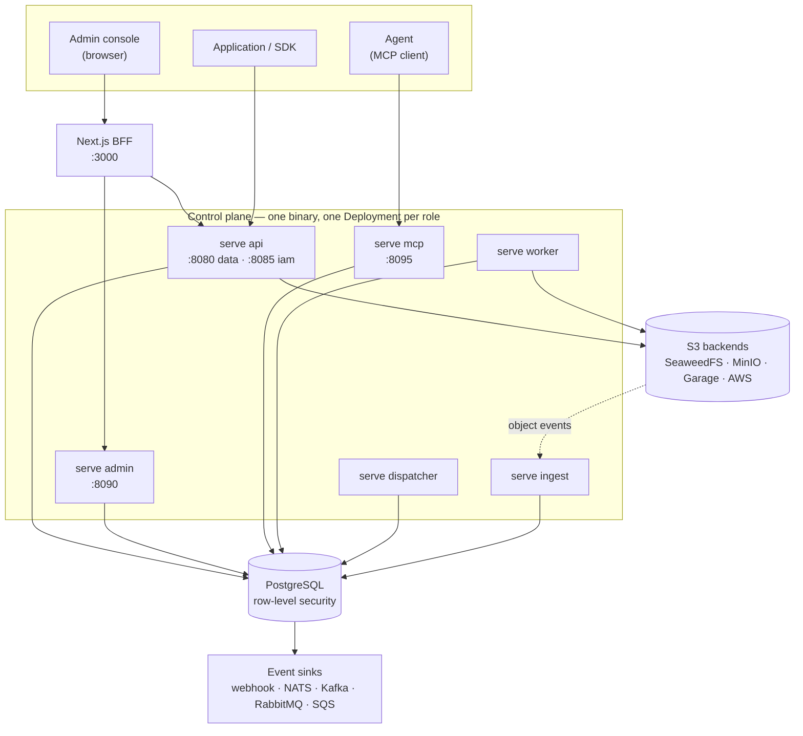

# Architecture

A tour of what the pieces are and why the boundaries fall where they do.
For the decisions themselves and the alternatives that lost, read
[`docs/adr/`](docs/adr/).

## What the system is for

Paladin puts a control plane in front of object storage. Applications do not
hold S3 credentials or a bucket name; they hold a Paladin credential scoped
to a tenant, and Paladin decides what that credential may do, routes the
bytes to whichever backend the tenant is on, meters what was spent, and
emits an event trail.

The problem it was built for is agentic workloads: an orchestrator spawns
sub-agents, each calling tools that cost money, and every call needs four
answers — may it, can it afford it, whose spend was it, and can I stop it
right now. A long-lived API key answers none of them. That is what the
[`capability`](capability/) primitive is for, and it is usable on its own,
without the rest of this system.

## The shape



Roles are processes, not modules: the Helm chart deploys one Deployment
per `paladin serve <role>`, so a stuck worker cannot take the API plane with
it, and each role gets its own resource envelope and network policy.

`serve mcp` is the exception that proves the rule — it is a superset of
the api and admin surfaces with no TCP listeners of its own, because an
agent needs both and there is no useful boundary to draw between them for
one process.

## How a request is authorised

Four mechanisms, applied in order, each answering a different question.

1. **Authentication — who is this?** A user JWT, an API token, or a
   capability token. All three land on a `Principal` carrying a kind
   (user, machine, agent), a tenant, and a role set. The credential kind
   survives into the policy layer, which matters: ADR-0012 exists because
   "may a machine delete this" and "may a user delete this" are different
   questions with different answers.

2. **Policy — may this principal do this?** Cedar. Policies are data, not
   code: they live in the database per tenant, with the platform defaults
   in [`backend/policies/`](backend/policies/). The console can simulate a
   decision before you save it, which is the only humane way to edit
   authorisation rules.

3. **Scope — does this credential reach this resource?** CEL expressions
   narrow a credential to a bucket prefix, an operation set, an IP range.
   A capability delegated to a sub-agent may only ever narrow, never
   widen.

4. **Isolation — can the query even see it?** Postgres row-level
   security, with the tenant set on the connection. This is a primary
   control, not defence in depth. Connection pools are split by trust
   level for that reason: the RLS pool carries tenant context, and the
   BYPASSRLS pool that background jobs use is a separate pool entirely, so
   a worker cannot inherit a request's scope by accident.

Budgets sit alongside all four. A capability carries a spend ceiling, and
usage is metered per call against the lineage that spent it — which run,
spawned by which parent.

## Storage

An object is a database row first and bytes second. The row records
tenant, bucket, key, version, tags, state and lifecycle; the bytes live
in whichever S3-compatible backend the tenant's bucket is routed to.
Anything S3 tracks weakly and Postgres tracks well — versions, tags,
quotas — is tracked in Postgres.

Uploads and downloads go direct to the backend through presigned URLs, so
bytes do not stream through the control plane. Presigning is why backends
carry two endpoints: the one the plane talks to, and the one URLs are
signed for. They differ whenever the plane and the browser reach storage
by different names, and SigV4 covers the Host header, so mixing them up
produces a signature failure rather than a connection error.

Backends can be added, disabled and rotated at runtime, and objects can
be migrated between them, including across backend types by streaming
through.

## Events

Everything durable goes through a transactional outbox (ADR-0003): the
state change and the event row commit in the same transaction, so there
is no window where one happened and the other did not. `serve dispatcher`
drains the outbox to webhook and broker sinks. Delivery is at-least-once,
and the dedup contract consumers need is written down in
[`docs/event-delivery-dedup.md`](docs/event-delivery-dedup.md).

The audit log uses the same pattern with its own table (ADR-0004), for
the same reason: an audit record that can be lost on a crash is not an
audit record.

`serve ingest` runs the other direction — storage-side notifications
(webhook or JetStream) promote objects whose bytes arrived out of band.

## The admin console

Next.js, with a BFF between the browser and the planes. The browser
never holds a plane URL or an upstream credential; it talks to
`/api/paladin`, and the BFF forwards over Connect. Both halves generate their
clients from the same `backend/proto/` directory, which is the main
reason they share a repository — a wire change is a two-sided change and
should be one commit.

## Repository layout

```
backend/      Go control plane — see backend/README.md
frontend/     Next.js BFF + admin console — see frontend/README.md
capability/   standalone Go module, no DB and no storage SDK
docs/         ADRs, runbooks, configuration reference
specs/        spec-driven-development artifacts per feature
tasks/        cross-project Taskfiles
BACKLOG.md    deferred work, with reasons
```

## Things that are deliberately not here

Read [BACKLOG.md](BACKLOG.md) before concluding something is missing by
oversight. It is long because the reasons are written down: what was
considered, why it was cut, and what would unblock it. A few of the
larger ones — a real `StorageReplicator` implementation, semantic search
over object metadata, cross-region database replication, self-service
password reset — are there with their blockers named.
