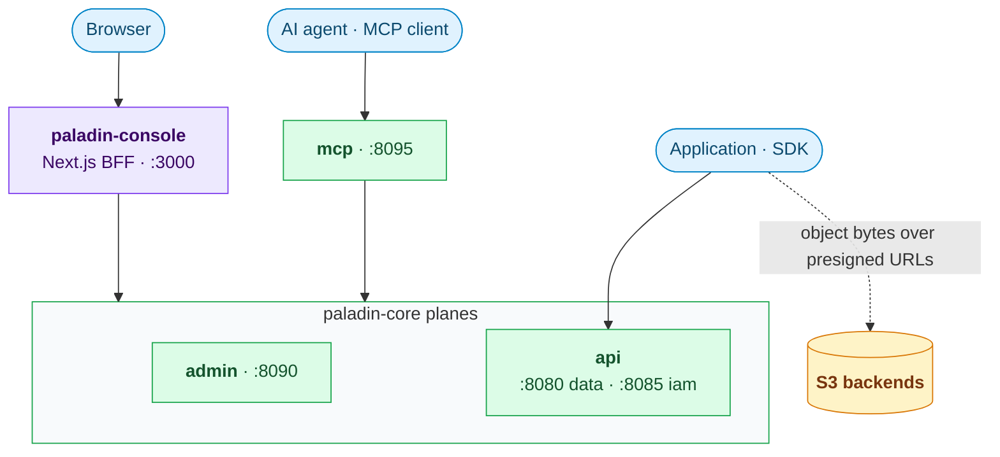
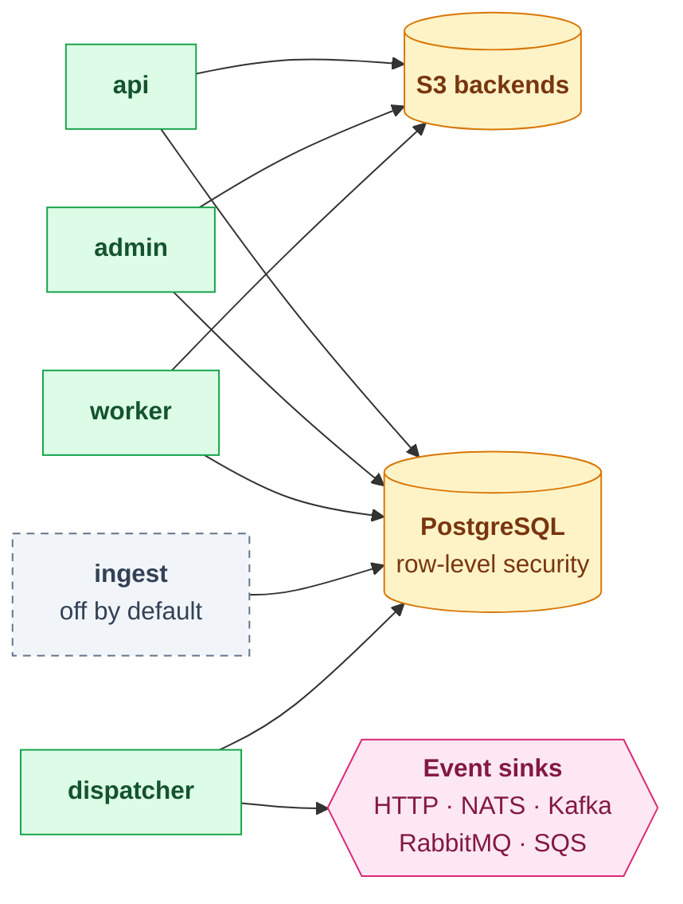
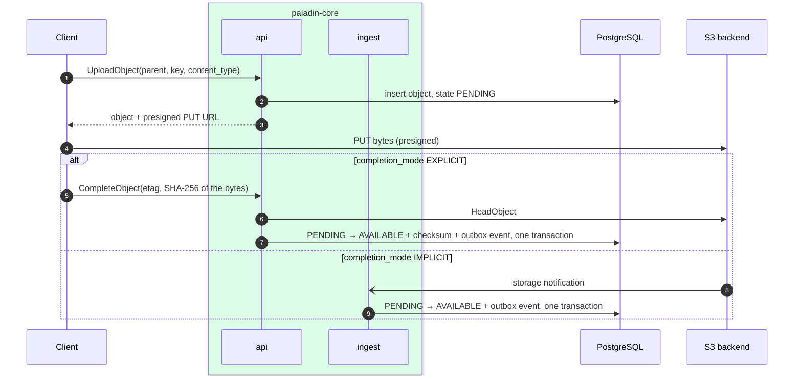

# Architecture

A tour of what the pieces are and why the boundaries fall where they do.
For the decisions themselves and the alternatives that lost, read
[`docs/adr/`](docs/adr/).

## What the system is for

Paladin puts a control plane in front of object storage. Applications do not
hold S3 credentials or a bucket name; they hold a Paladin credential scoped
to a tenant, and Paladin decides what that credential may do, resolves
which backend and bucket the tenant is on, meters what was spent, and emits
an event trail. It is a control plane only: object bytes never pass through
the API (see [Storage](#storage)).

The problem it was built for is agentic workloads: an orchestrator spawns
sub-agents, each calling tools that cost money, and every call needs four
answers — may it, can it afford it, whose spend was it, and can I stop it
right now. A long-lived API key answers none of them. That is what the
[`capability`](capability/) primitive is for, and it is usable on its own,
without the rest of this system.

## The shape



What each role reaches. Every role but `mcp` (in its default bridge mode)
uses PostgreSQL; `ingest` also receives storage notifications, over a webhook,
NATS, RabbitMQ or SQS. The S3 calls each role makes are in [Storage](#storage).



Roles are processes, not modules: the Helm chart deploys one Deployment
per `paladin serve <role>`, so a stuck worker cannot take the API plane with
it, and each role gets its own resource envelope and network policy.

`serve mcp` holds no data of its own: in its default bridge mode it exposes
the api and admin RPCs as MCP tools and calls those planes over HTTP with the
caller's credential, so every policy and quota check still happens there.
With `--embedded` it hosts those handlers in-process instead, and then opens
the database itself.

## How a request is authorised

Four mechanisms, applied in order, each answering a different question.

1. **Authentication — who is this?** A user JWT, an API token, or a
   capability token. All three land on a `Principal` carrying a kind
   (user, machine, agent), a tenant, and a role set. The credential kind
   survives into the policy layer, which matters: ADR-0012 exists because
   "may a machine delete this" and "may a user delete this" are different
   questions with different answers.

2. **Policy — may this principal do this?** Cedar. Policies are data, not
   code: they live in the database per tenant, with the platform defaults
   in [`backend/policies/`](backend/policies/). The console can simulate a
   decision against a policy before it is saved.

3. **Scope — does this credential reach this resource?** A scoped API
   token or capability names the tenant, backend, bucket or collection it
   reaches, and a built-in Cedar `forbid` denies everything outside it,
   whatever the tenant's policies permit. A capability also narrows the
   operations and source addresses it may be used for, and a capability
   delegated to a sub-agent may only ever narrow, never widen. (CEL is used
   elsewhere: it filters list results, it does not authorise.)

4. **Isolation — can the query even see it?** Postgres row-level
   security, with the tenant set on the connection. This is a primary
   control, not defence in depth. Connection pools are split by trust
   level for that reason: the RLS pool carries tenant context, and the
   BYPASSRLS pool that background jobs use is a separate pool entirely, so
   a worker cannot inherit a request's scope by accident.

Budgets sit alongside all four. A capability carries a spend ceiling, and
usage is metered per call against the lineage that spent it — which run,
spawned by which parent.

## Storage

An object is a database row first and bytes second. The row records
tenant, bucket, key, version, tags, state and lifecycle; the bytes live
in whichever S3-compatible backend the tenant's bucket is routed to.
Anything S3 tracks weakly and Postgres tracks well — versions, tags,
quotas — is tracked in Postgres.

**Paladin does not proxy object traffic.** Uploads and downloads go
directly between the client and the backend over presigned URLs, which the
api plane signs locally. What Paladin itself sends to S3:

| Role | Calls | Why |
| --- | --- | --- |
| api | `HeadObject` | verify a completed upload |
| api | `CreateMultipartUpload`, `CompleteMultipartUpload`, `AbortMultipartUpload` | open and close a multipart upload; its parts are uploaded over presigned URLs |
| api, worker | `CopyObject`, `DeleteObject` | server-side copy; permanent delete, purge of the trash |
| worker | `CreateBucket`, `DeleteBucket` | provision and remove buckets |
| worker | `GetObject` → `PutObject` | copy objects during an operator-started migration between backends — the one path where bytes pass through a Paladin process |
| admin | `ListBuckets` | health probe of a registered backend |



Presigning is why backends carry two endpoints: the one the plane talks
to, and the one URLs are signed for. They differ whenever the plane and
the client reach storage by different names, and SigV4 covers the Host
header, so mixing them up produces a signature failure rather than a
connection error.

Backends can be disabled, put in maintenance and drained at runtime. A backend
that will hold buckets has to be declared in the configuration; one registered
only through the API can be probed but not used yet
([backend-registry.md](backend/docs/backend-registry.md)).

## Events

Everything durable goes through a transactional outbox (ADR-0003): the
state change and the event row commit in the same transaction, so there
is no window where one happened and the other did not. `serve dispatcher`
drains the outbox to webhook and broker sinks. Delivery is at-least-once,
and the dedup contract consumers need is written down in
[`docs/event-delivery-dedup.md`](docs/event-delivery-dedup.md).

The audit log uses the same pattern with its own table (ADR-0004), so an
audit record cannot be lost between the change and the write.

`serve ingest` runs the other direction: it receives storage-side
notifications — over a webhook, NATS (core or JetStream), RabbitMQ or SQS —
and marks objects whose bytes arrived out of band as active, writing to
PostgreSQL directly.

## Clients

Applications use the [Go](sdk/go/README.md) and [Python](sdk/python/README.md)
SDKs: the generated Connect clients, a client for every service of each plane,
and the work that takes more than one call — sessions, idempotency keys and
retries, uploads and downloads over presigned URLs. The RPCs and the presigned
transfers are separate legs with separate transports and TLS: a presigned
request goes to storage and carries none of the client's credentials. A whole
download is verified against the checksum the upload recorded.

The server's side of that contract: every mapped error carries a
`google.rpc.ErrorInfo` reason from `paladin.common.v1.ErrorReason`, and every
response names the release, so the SDKs raise typed errors and name both sides
of a contract skew. Both SDKs ship an in-memory data plane for consumers'
tests, and run the same scenarios against the server in CI. The layers are in
[diagrams.md](backend/docs/diagrams.md#sdk-layers).

## The admin console

Next.js, with a BFF between the browser and the planes. The browser never
holds a plane URL or the refresh token, which stays in an httpOnly cookie; it
calls `/api/rpc/{data,iam,admin}` with short-lived access tokens, and the BFF
forwards over Connect. Both halves generate their
clients from the same `proto/` directory, which is the main
reason they share a repository — a wire change is a two-sided change and
should be one commit.

## Diagrams

[`backend/docs/diagrams.md`](backend/docs/diagrams.md) has the rest: context,
code layout, the request path through the interceptors, upload, events,
background work, the console session, the contract fan-out, the SDK layers,
the schema and the deployment. The path from a pull request to a signed release is in
[`docs/how-changes-land.md`](docs/how-changes-land.md).

## Repository layout

```
backend/      Go control plane — see backend/README.md
frontend/     Next.js BFF + admin console — see frontend/README.md
capability/   standalone Go module, no DB and no storage SDK
docs/         ADRs, runbooks, configuration reference
specs/        spec-driven-development artifacts per feature
proto/        the API contract the backend, console and SDKs generate from
sdk/          the Go and Python SDKs; sdk/testdata holds what both are tested against
BACKLOG.md    deferred work, with reasons
```

## Things that are deliberately not here

Read [BACKLOG.md](BACKLOG.md) before concluding something is missing by
oversight. It is long because the reasons are written down: what was
considered, why it was cut, and what would unblock it. A few of the
larger ones — a real `StorageReplicator` implementation, semantic search
over object metadata, cross-region database replication, self-service
password reset — are there with their blockers named.
