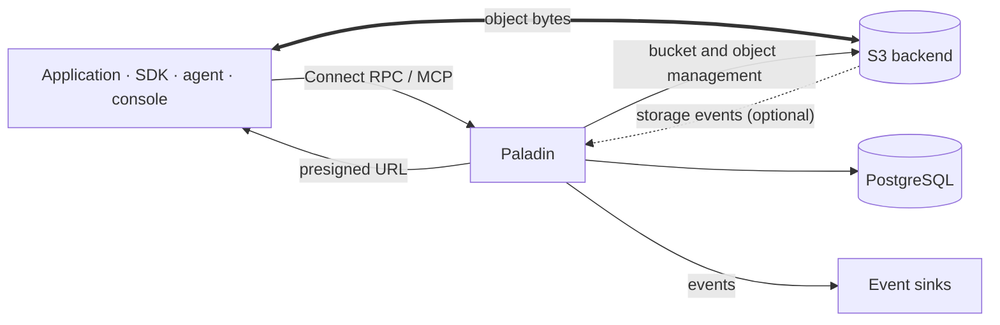
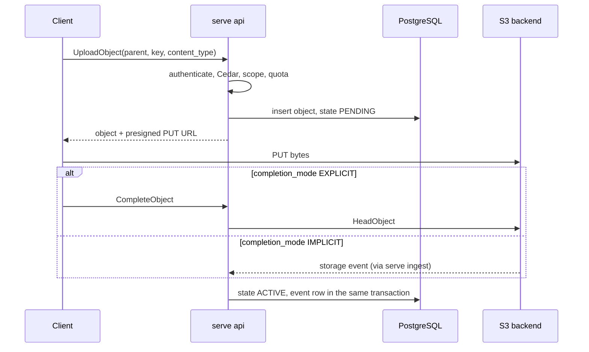
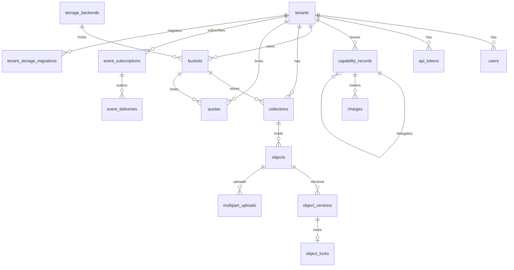
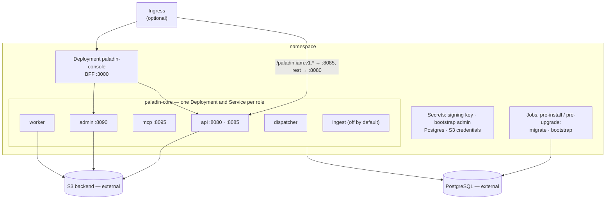

# Diagrams

Drawn from the code, the Helm chart and the migrated schema. The prose that
explains them is in [ARCHITECTURE.md](../../ARCHITECTURE.md).

## Context

Paladin is a control plane: the RPCs carry metadata, and object bytes move
between the client and S3 over presigned URLs.

## Main request: upload

## Schema

The core tables and their foreign keys. Rate buckets, idempotency keys, OAuth,
leases and the audit log (partitioned monthly, no foreign keys) are left out.

## Deployment

What one install of both charts creates, and what it expects to find.

The admin plane has no Ingress route; the console reaches it inside the
cluster. See [docs/install.md](../../docs/install.md).
