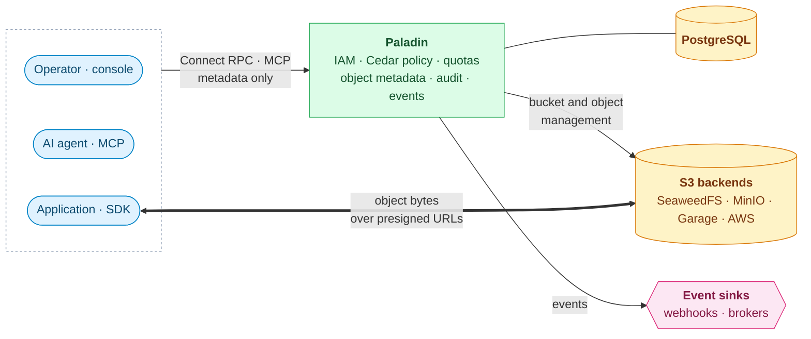
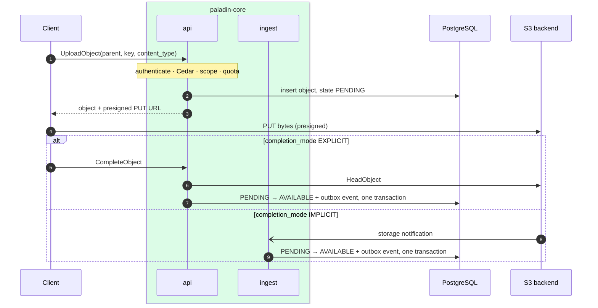
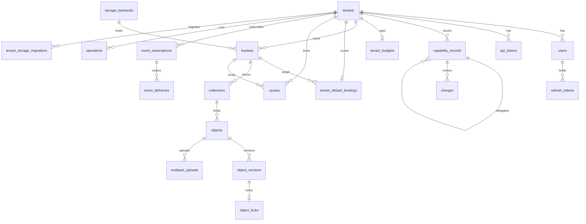
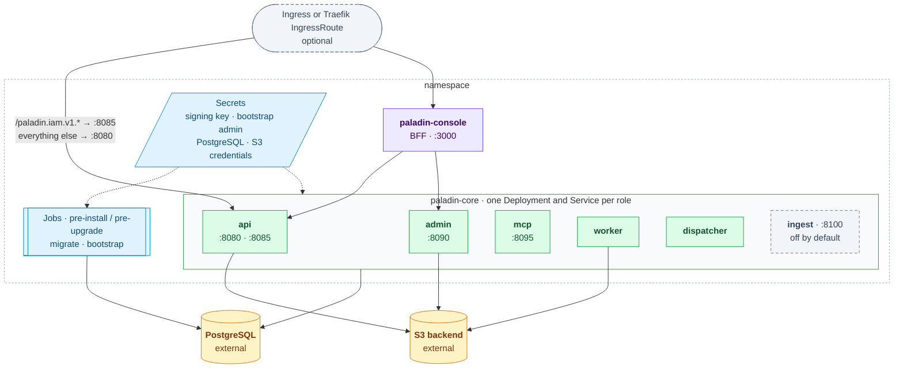

# Diagrams

Drawn from the code, the Helm chart and the migrated schema. The prose that
explains them is in [ARCHITECTURE.md](../../ARCHITECTURE.md), which also has
the per-role diagram.

Colours are consistent across diagrams: blue for clients and Kubernetes
objects, violet for the console, green for paladin-core roles, grey dashed for
components off by default, amber for stores, pink for external sinks.

## Context

Paladin is a control plane: the RPCs carry metadata, and object bytes move
between the client and S3 over presigned URLs.

## Main request: upload

The api plane authorises the call, records the object as `PENDING` and returns
a presigned URL. The object becomes `AVAILABLE` either on `CompleteObject`
(explicit) or on the storage notification `ingest` receives (implicit); in
both cases the transition and its outbox event commit together
(`statemachine.Transitioner.PromoteToAvailableInTx`).

## Schema

The core tables and their foreign keys, from `backend/migrations`. Rate
buckets, idempotency keys, OAuth, leases, ingest dedup and the audit log
(partitioned monthly) are left out.

## Deployment

What one install of both charts creates, and what it expects to find.

The admin plane has no Ingress route; the console reaches it inside the
cluster. See [docs/install.md](../../docs/install.md).
