# Diagrams

Drawn from the code, the Helm chart and the migrated schema. The prose that
explains them is in [ARCHITECTURE.md](../../ARCHITECTURE.md), which also has
the per-role diagram.

Colours are consistent across diagrams: blue for clients and Kubernetes
objects, violet for the console, green for paladin-core roles, grey dashed for
components off by default, amber for stores, pink for external sinks.

## Context

Paladin is a control plane: the RPCs carry metadata, and object bytes move
between the client and S3 over presigned URLs.

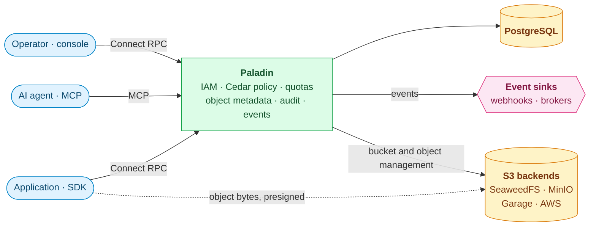

## Code layout: handlers own their ports

A handler package declares the interfaces it needs; the Postgres and S3
adapters implement them. That is why `internal/store` and `internal/storage`
import `internal/api`: the arrow points at the interface, not the caller.

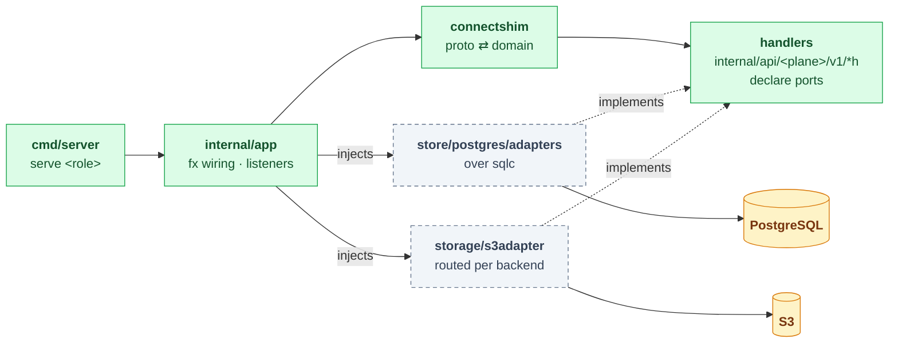

## Request path

One data-plane call, outermost first (`internal/app/build_listeners_api.go`).
Every response carries the release in `X-Paladin-Version`, and a procedure the
release does not serve is answered with a Connect `Unimplemented` rather than a
bare 404, so a client can name both sides of a contract skew
(`middleware.ServerVersion`, `middleware.UnknownProcedure`). An error the
handler returns from a domain sentinel goes out with a `google.rpc.ErrorInfo`
whose reason is a `paladin.common.v1.ErrorReason` (`apiutil.MapError`). The iam plane lets `Login`,
`RefreshToken` and `ExchangeAudience` through anonymously and adds a login rate
limit and an audit of mutations; the admin plane accepts API tokens only when
they carry roles, and audits its mutations too. On the data plane a platform
admin's request acts on the tenant it names (`middleware.ActOnNamedTenant`),
which every later step keys on, and such calls inside another tenant are
audited there (`middleware.AuditActingElsewhere`).

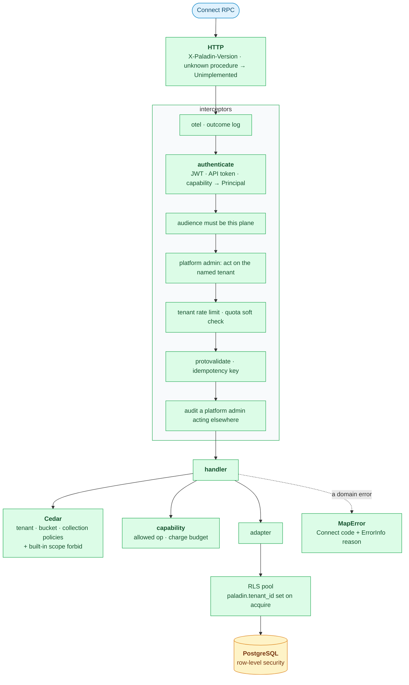

Policies are compiled once per tenant and cached; a `LISTEN policy_changed`
connection evicts them, and flushes everything after a reconnect. A mutation
writes its outbox row in the same transaction as the change.

## Main request: upload

The api plane authorises the call, records the object as `PENDING` and returns
a presigned URL. The object becomes `AVAILABLE` either on `CompleteObject`
(explicit) or on the storage notification `ingest` receives (implicit); in
both cases the transition and its outbox event commit together
(`statemachine.Transitioner.PromoteToAvailableInTx`). The SDKs send the
content's SHA-256 with `CompleteObject`, and verify a whole download against
it.

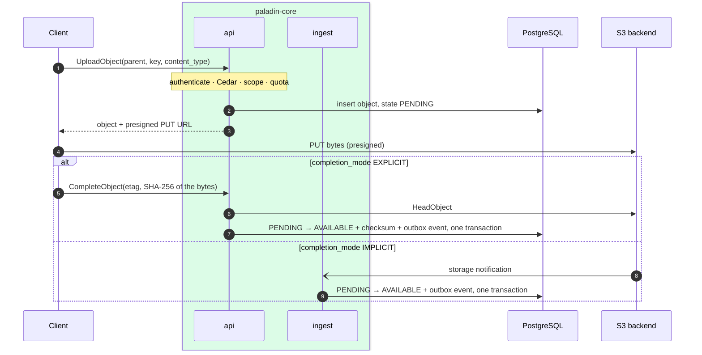

## Events

Every producer writes the event row in the transaction that made the change;
`dispatcher` delivers it at least once. `ingest` runs the other way, turning
storage notifications into state changes. The audit log has its own table and
a live stream.

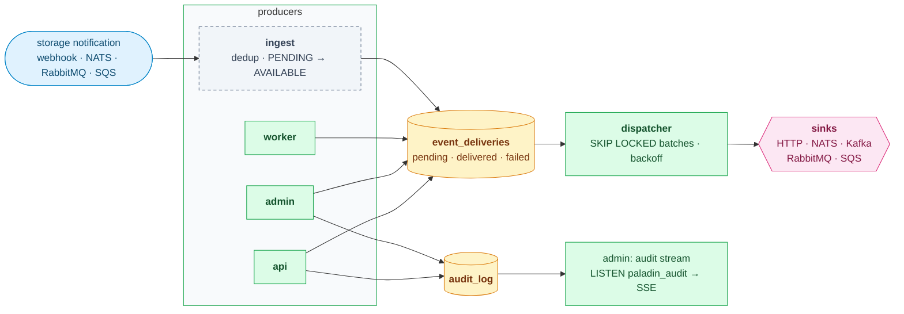

A row that exhausts its attempts stays `failed`; nothing redrives it. Consumers
deduplicate on the event id ([event-delivery-dedup.md](../../docs/event-delivery-dedup.md)).

## Background work

`worker` runs each job in one replica at a time, under a lease in
`worker_leases`. Jobs use the BYPASSRLS reaper pool, because they act across
tenants. The job list is in [ops-housekeeping.md](ops-housekeeping.md).

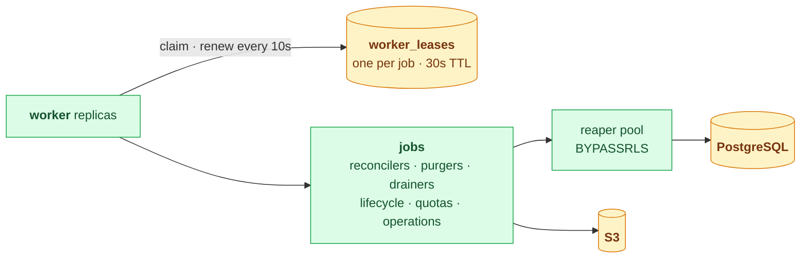

## Console session

The browser holds only short-lived access tokens; the refresh token stays in an
httpOnly cookie the BFF reads. Every plane call goes through the BFF.

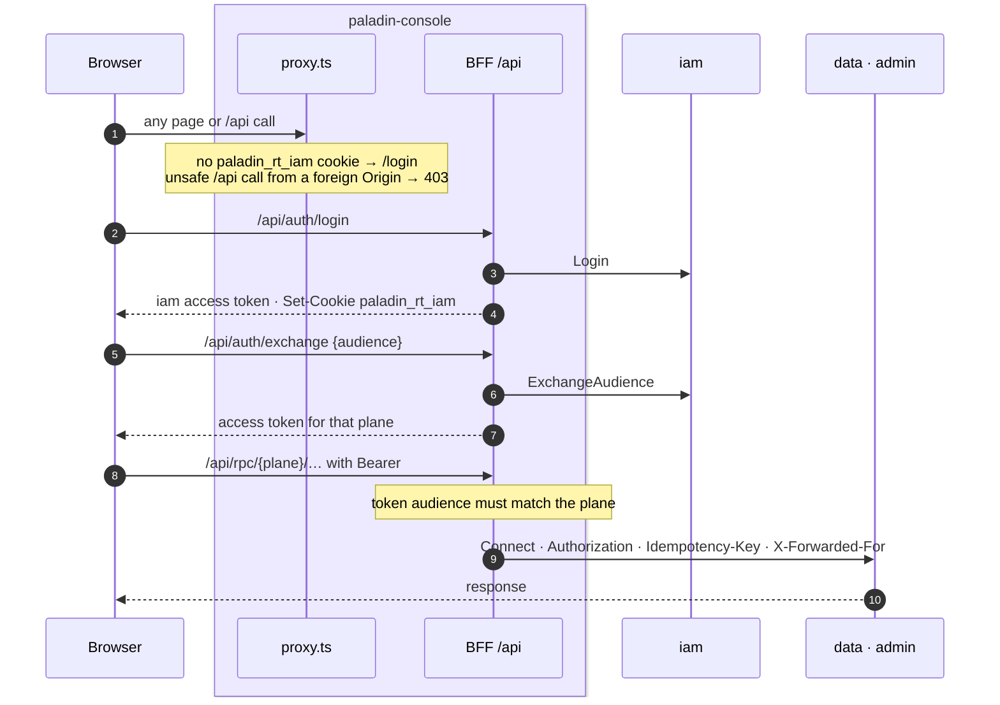

## Contract fan-out

`proto/` is the one contract. Its generators each have a drift gate in
`verify-all`; `verify:proto-breaking` refuses a wire-incompatible change
against the last contract tag. Each SDK also generates a facade — a client for
every service of each plane — from the stubs, so a new service needs no
hand-written wiring. The Python stubs are generated with the protoc of
`grpcio-tools` 1.81.1, whose gencode version is the protobuf floor the package
declares (6.33.5), so they run on protobuf 6 and 7.

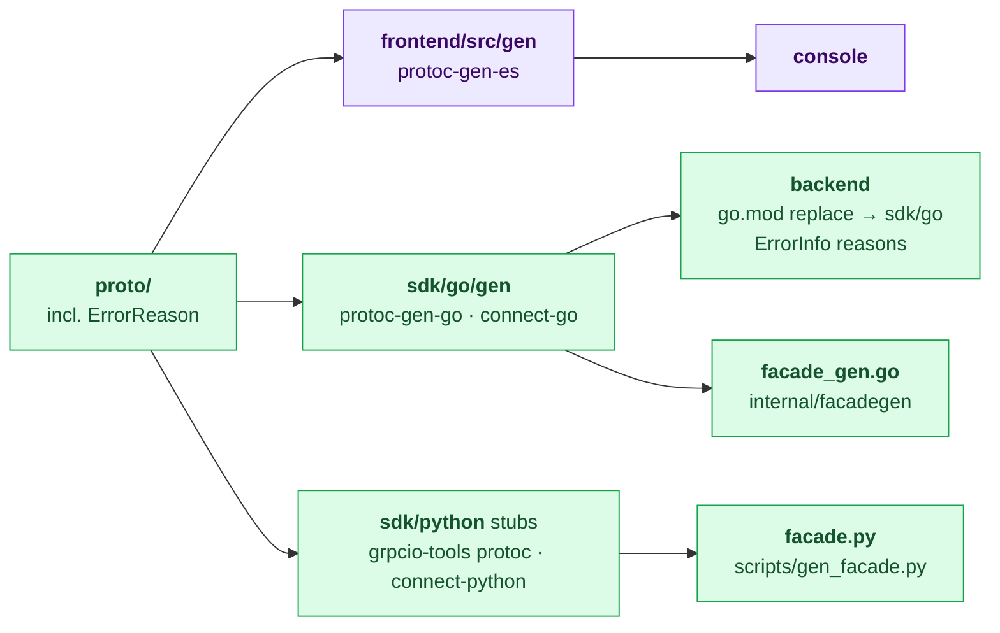

## SDK layers

Both SDKs are the same stack of layers over the generated clients
([ADR-0018](../../docs/adr/0018-sdk-layers.md)). The RPCs and the presigned
transfers are separate legs with separate transports: a presigned request goes
to storage, not to Paladin, and carries none of the client's credentials.

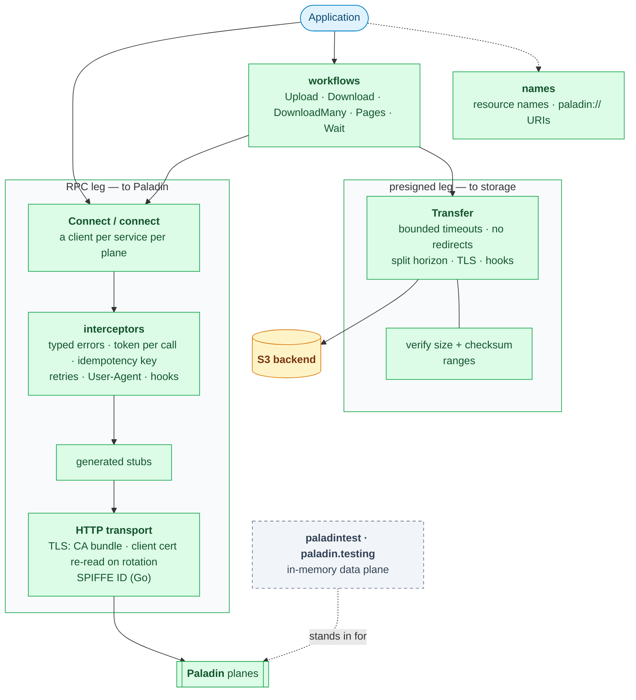

Both SDKs run the same scenarios against the stack in CI
(`sdk/testdata/scenarios.json`), and parse names against the same table
(`sdk/testdata/names.json`); where they differ on purpose, the READMEs say so.

## Schema

The core tables and their foreign keys, from `backend/migrations`. Left out:
rate buckets, idempotency keys, OAuth, DPoP replay (`dpop_seen_jti`), leases,
ingest dedup, the audit log (partitioned monthly), the tag catalogue
(`object_tags`), slug history, backend health, replication state, and the
purge and multipart-abort queues (`pending_purges`, `pending_multipart_aborts`).

Identity and access:

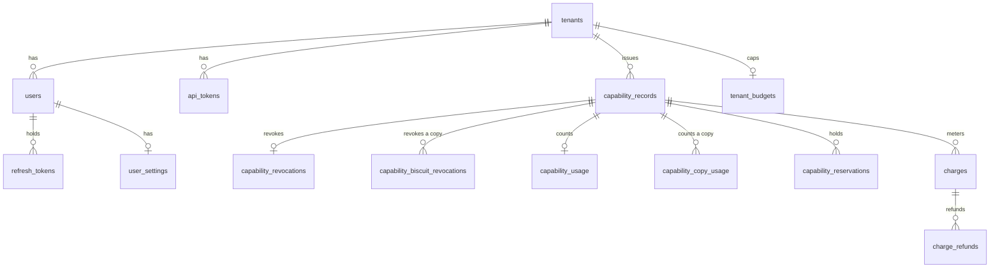

Storage:

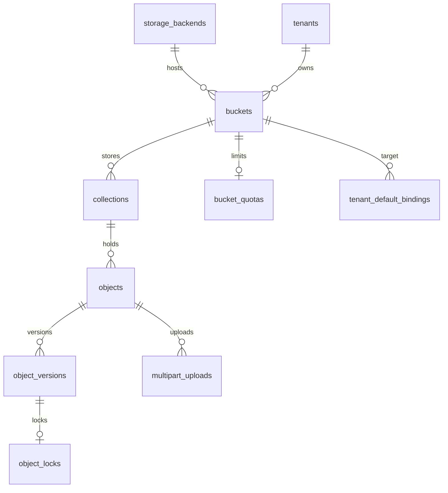

Events and operations:

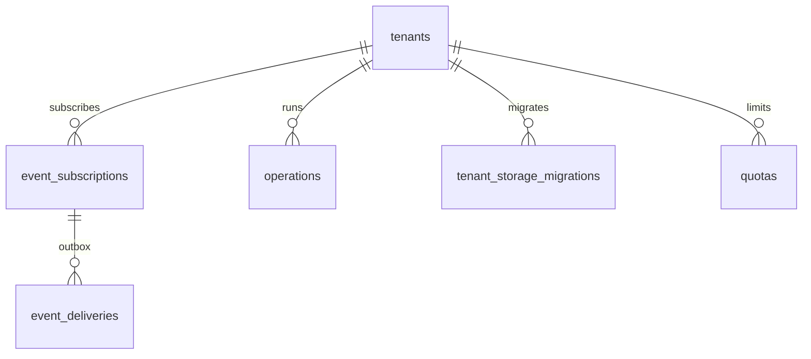

`capability_records` also references itself: a delegated capability points
at its parent. The two `copy` tables are keyed by a Biscuit block's revocation
id rather than a uuid: a copy exists only in its holder's hands, and the id is
all the server ever sees of it (ADR-0021).

## Deployment

What one install of both charts creates, and what it expects to find.

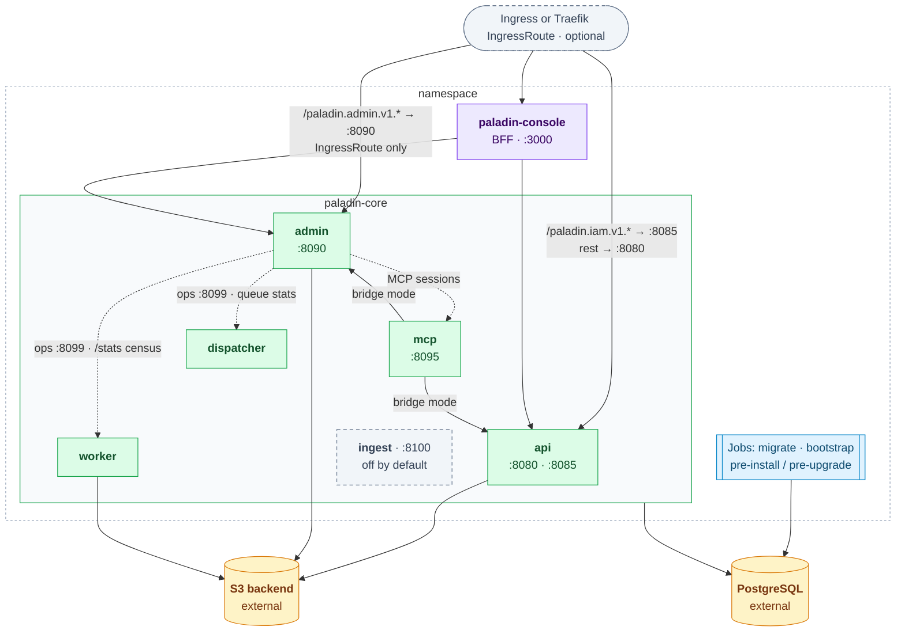

The standard Ingress routes only the api role. The Traefik IngressRoute also
routes `/paladin.admin.v1.*` to `admin` on the shared host, or moves the admin
plane to its own host when `traefik.planes.admin.hosts` is set; either way the
console reaches `admin` inside the cluster. Every role except `mcp` (in bridge
mode, as the chart runs it) uses PostgreSQL; `api`, `admin` and `worker` call
S3.

`admin` proxies three views the console reads from other roles' listeners —
the stats behind the platform-admin role, the sessions behind a Cedar check:
the cross-tenant `/stats` census and
the tenants behind each count it flags, from the worker
(`SystemService.GetPlatformStats` and `ListPlatformStatsTenants` →
`worker.ops_url` → `/system/rls-census.json` and
`/system/rls-census/tenants.json`, served by `internal/platformstats` on the
worker's BYPASSRLS pool); the outbox queue view, from the dispatcher
(`GetDispatcherStats` → `dispatcher.ops_url`); and live MCP sessions, from
`mcp` (`MCPInspectService.ListSessions` → `mcp.http.sessions_url`). The
worker's Service publishes `:8099` and targets container port `:8090`.

The chart also creates Secrets for the signing key, the bootstrap
admin and the S3 credentials, and reads the PostgreSQL ones you supply. See
[docs/install.md](../../docs/install.md).
