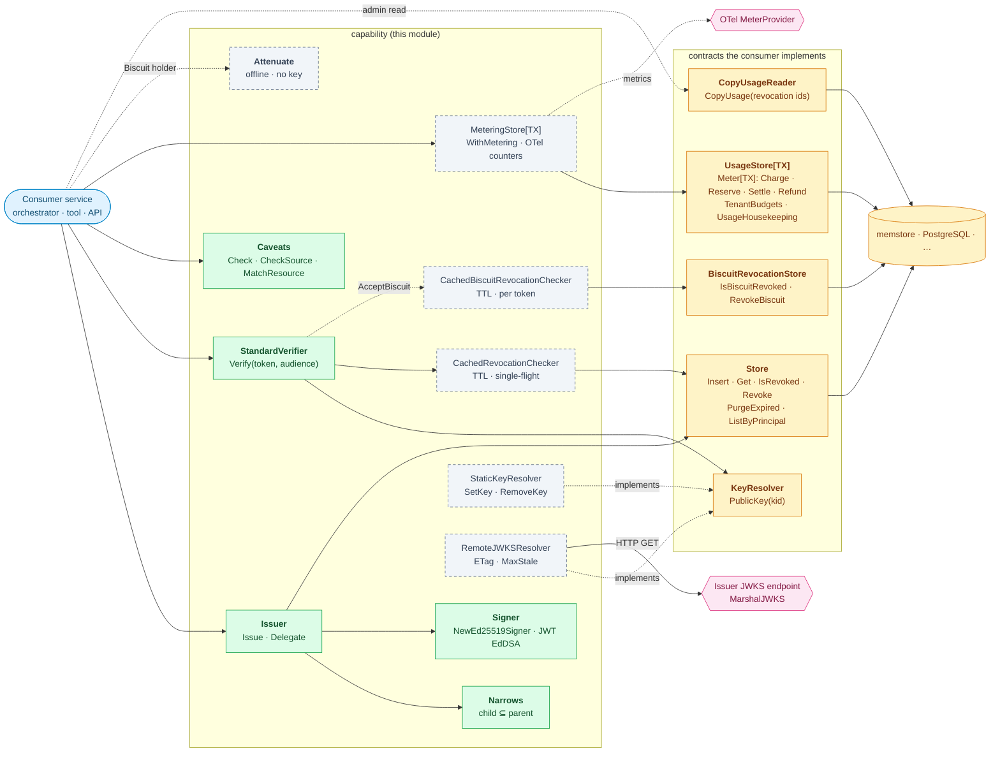
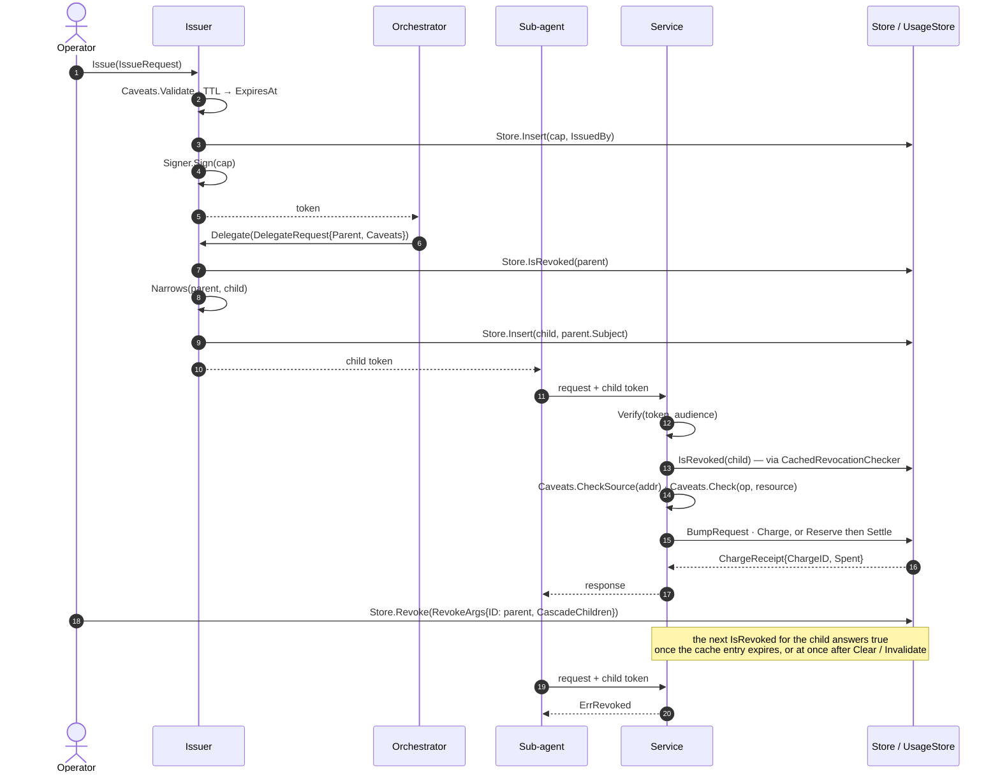
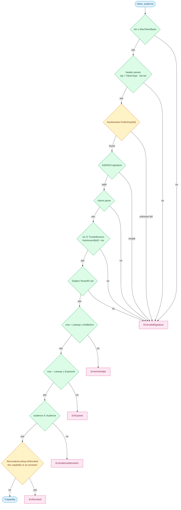
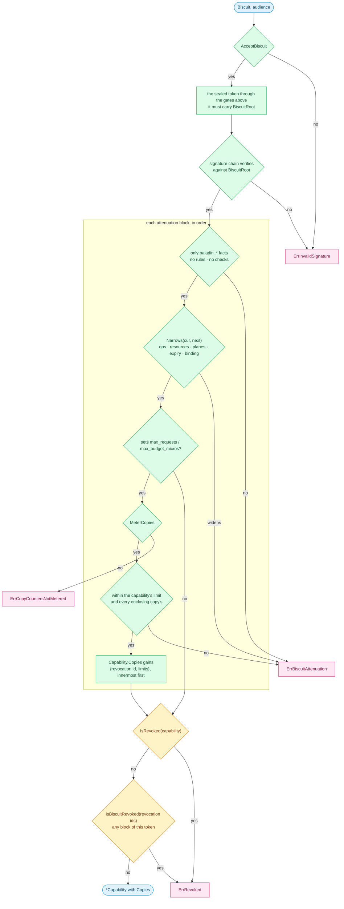
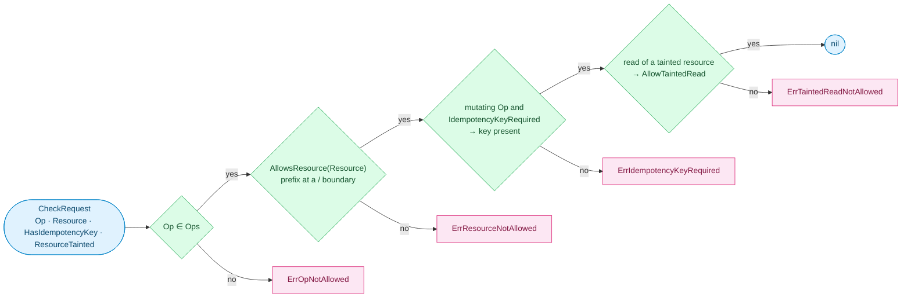
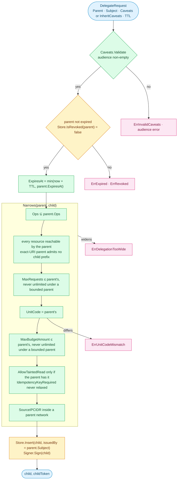
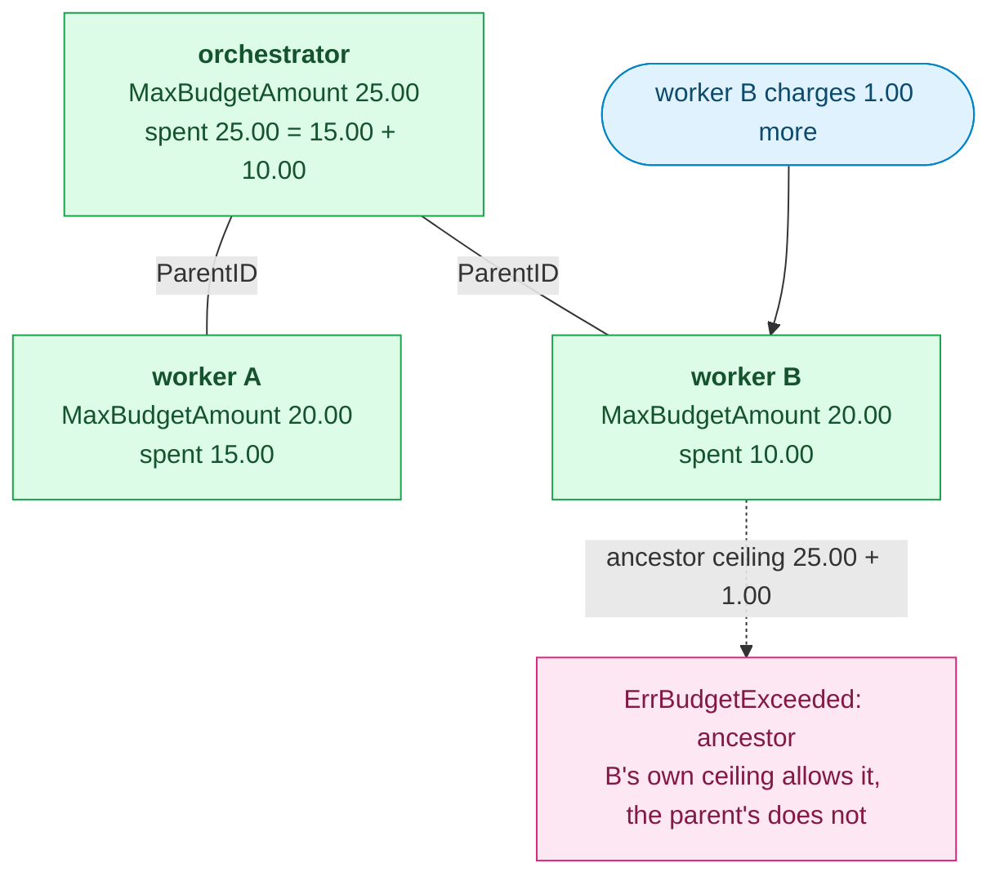
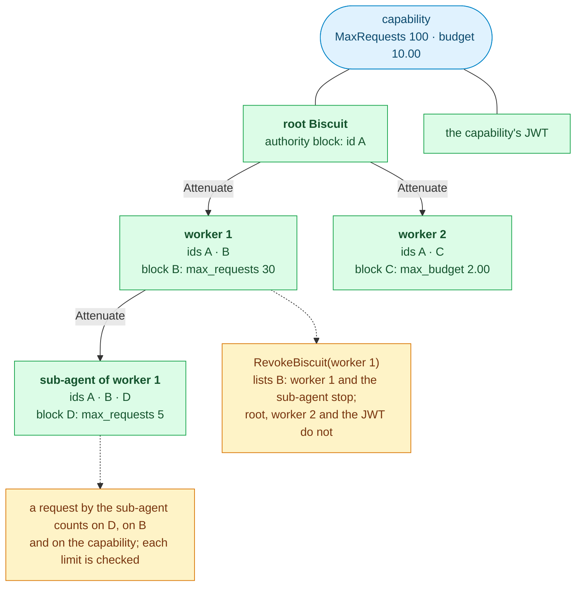
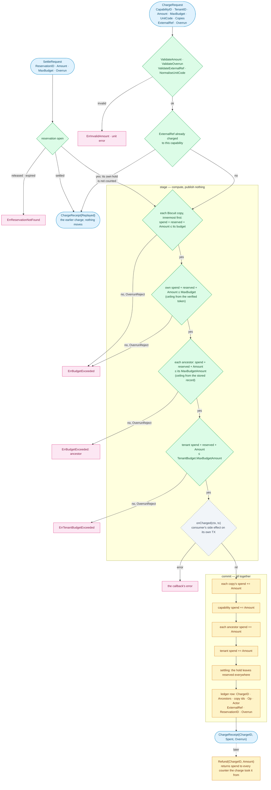
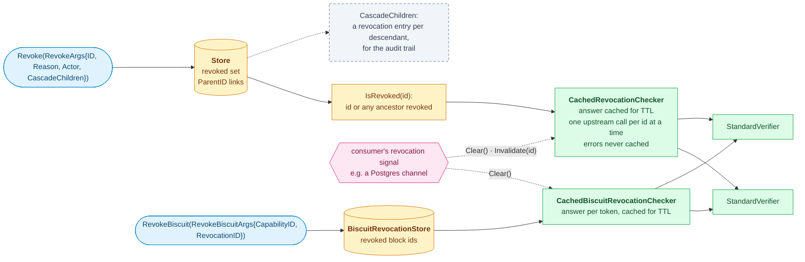

# Diagrams

Drawn from the code of this module. The prose that explains the behaviour is in
[README.md](../README.md) and the package documentation in
[doc.go](../doc.go); the identifiers on the diagrams are the exported names, so
a renamed type shows up as a stale label.

Colours follow the rest of the repository: blue for callers, green for what
this module ships, amber for the contracts a consumer implements and stores
behind them, grey dashed for optional pieces, pink for things outside the
process.

## Contract boundary

The module ships the primitive and its contracts; the consumer supplies the
storage behind them. `memstore` is the in-memory reference implementation, and
Paladin's PostgreSQL adapters are another. The two Biscuit contracts are needed
only by a consumer that accepts the Biscuit form.

`Store` and `UsageStore` are separate types on purpose: both declare a `Get`
with different signatures, so one type cannot satisfy both. `TX` is the
consumer's transaction handle; the module only threads it back through
`Meter.Charge`, which is why it has no database dependency.

## Lifecycle of a capability

One orchestrator, one sub-agent, one service. Every call carries a token; the
service verifies it locally, enforces the caveats, then meters the call.

## Verification gates

`StandardVerifier.Verify` reads nothing from the claims until the signature
over them has verified, and asks the revocation store last so that cheap
rejections never reach it. Every exit is a sentinel the caller maps to its own
transport status.

An unknown kid, an untrusted issuer, a kid bound to another issuer and a
missing tenant all surface as `ErrInvalidSignature`, so security-sensitive
callers cannot branch on which one it was.

A Biscuit goes through the same gates, around them. Its authority block seals
an ordinary signed token, which is checked as above; that token names the key
rooting the Biscuit's chain, which is checked next, and then each attenuation
block is folded in. The capability that comes out is narrower than the sealed
one and carries the limits its blocks set; both revocation lists are asked
last.

The sealed token presented on its own is refused, so it cannot be lifted out
to shed an attenuation. `ErrBiscuitAttenuation` and
`ErrCopyCountersNotMetered` both match `ErrInvalidSignature`.

Verification proves the token is genuine. What the bearer may do with it is a
second, separate step, `Caveats.Check`, evaluated per operation:

Each of the four also matches `ErrCaveatViolation`. The source-address caveat
is per connection and checked by `Caveats.CheckSource`, which fails closed on
an unknown address with `ErrSourceIPNotAllowed`. Budget and request ceilings
are stateful and belong to the `UsageStore`.

## Delegation: attenuate, never escalate

`Issuer.Delegate` refuses a parent that is expired or revoked, clamps the
child's expiry to the parent's, and then requires `Narrows(parent, child)` to
pass before anything is persisted or signed.

Narrowing bounds each child on its own. The tree as a whole is bounded at use:
every charge also counts against each ancestor, read from the ancestor's
stored record. A parent holding 25.00 that delegates 20.00 to each of two
workers can still spend 25.00 in total, not 40.00:

## Biscuit copies: one tree, revoked and counted by block

Every attenuation appends a block, and every block has a revocation id — its
signature. A copy carries the ids of every block above it, so an id names a
copy *and everything attenuated from it*. The same ids key both of the things
a holder's copy can have on its own: a revocation, and limits.

- **Revocation.** `BiscuitCopy` checks a copy as `Verify` does and names its
  capability and last block's id; `BiscuitRevocationStore.RevokeBiscuit` lists
  it. Revoking the capability still stops every copy and the JWT.
- **Limits.** A block may set `max_requests` and `max_budget_micros`, within
  every limit in force. The `Meter` counts each under the block's id, beside
  the capability's own counters, and a charge or reservation records the ids
  it debited so a refund, settle or release returns to them.
  `CopyUsageReader` reads the counters back.
- **Delegation from a copy** narrows from the copy as presented, not from the
  capability's record; a copy with limits of its own cannot delegate, because
  a server-side child would count against the capability and never the copy.

## Charge: stage, then commit

`Meter.Charge` checks three ceilings and runs the consumer's side effect before
any counter moves. A rejection at any stage, or a failing `onCharged`, leaves
the capability's counter, every ancestor's, the tenant aggregate and the
ledger exactly as they were, so a retry after a rejection is safe.

A cost known only afterwards goes through a reservation instead. `Reserve`
holds an estimate against the same three ceilings, and `Settle` charges the
actual cost along the same path, releasing the hold in the same commit. Every
ceiling counts open holds as well as spend, so two callers cannot both hold
the last of a budget.

`BumpRequest` takes the same order for requests: each copy's limit, then the
capability's, then each ancestor's. A reservation keeps its copies' budgets,
so `Settle` checks them without being handed the token again.

A settle rejected by a ceiling leaves the reservation in place, to be settled
lower or released with `Release`. Under `OverrunRecord` no ceiling rejects: a
check that fails marks the charge as an overrun and the stage goes on, since
the cost has already been incurred; the crossed ceiling then refuses whatever
follows under `OverrunReject`. A charge named by `ExternalRef`, or a settle of
a reservation already settled, returns the earlier charge and moves nothing. A hold never settled lapses at its
`ExpiresAt`, but keeps counting until `ReleaseExpired` runs, which errs towards
refusing spend rather than allowing too much.

A store with transactions runs stage and commit inside one, and passes its own
handle as `tx`; a store without them is instantiated as
`UsageStore[struct{}]` and the caller passes `nil` for `onCharged`.

## Revocation reaches the verifiers

Revocation is a write to the `Store`; verifiers see it through
`IsRevoked`, which answers for the whole delegation chain, usually behind a
`CachedRevocationChecker`.

Revoking a capability stops everything delegated from it whether or not
`CascadeChildren` is set, because `IsRevoked` walks the ancestors; the flag
only adds the per-descendant entries that name each stopped capability. Without
a revocation signal, a verifier learns of a revocation within the cache TTL.
Revoked Biscuit copies travel the same way, on their own list and cache; one
signal clears both.

A verifier that runs apart from the issuer resolves keys with
`RemoteJWKSResolver`: it serves the cached key set for `RefreshInterval`,
revalidates with an ETag, refetches on an unknown kid at most once per
`MinRefreshInterval`, and fails closed with `ErrJWKSUnavailable` once the last
good set is older than `MaxStale`.
