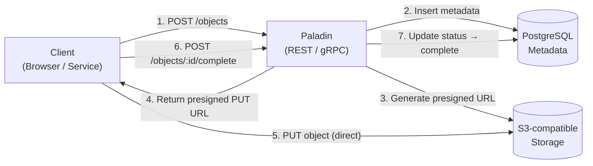
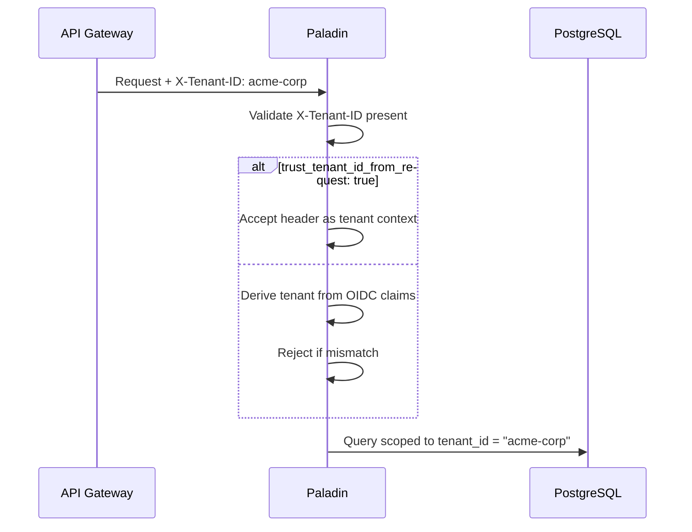
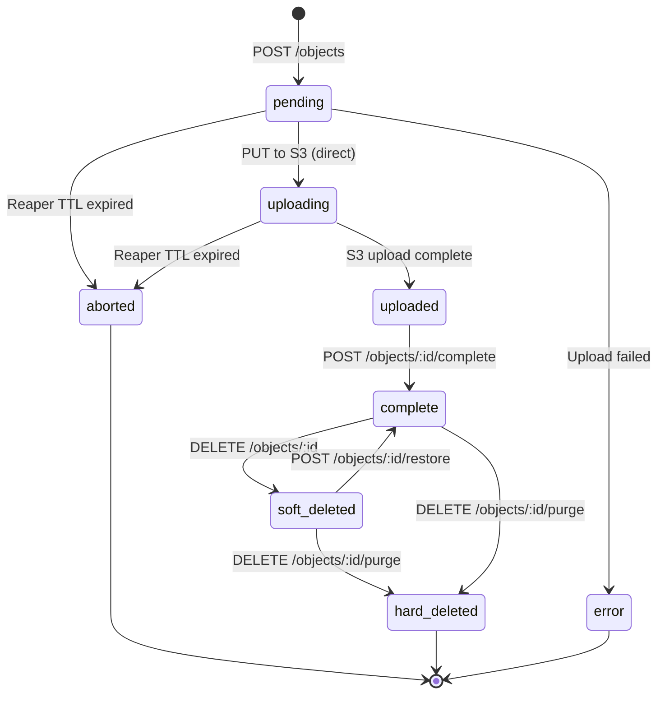
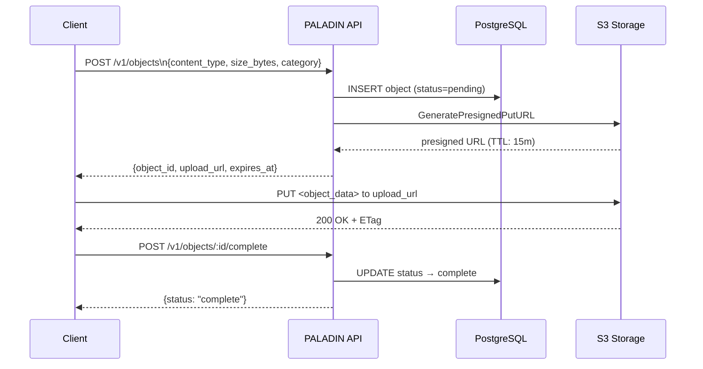
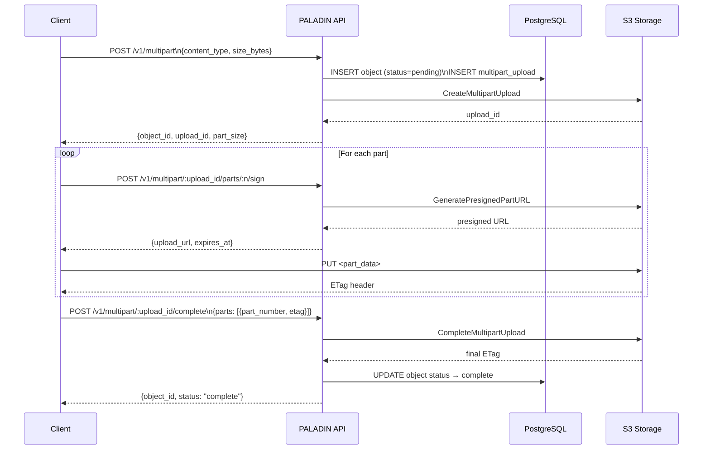

# Paladin — API Documentation

> **Source of truth**: [`api/openapi.yaml`](../api/openapi.yaml) and [`proto/paladin/v1/paladin.proto`](../proto/paladin/v1/paladin.proto).
> This document is a human-readable companion. Always verify against the spec files.

---

## Table of Contents

- [Overview](#overview)
- [Authentication & Multi-Tenancy](#authentication--multi-tenancy)
- [Rate Limiting](#rate-limiting)
- [Idempotency](#idempotency)
- [Error Format](#error-format)
- [Object Lifecycle](#object-lifecycle)
- [REST API — Objects](#rest-api--objects)
- [REST API — Multipart Uploads](#rest-api--multipart-uploads)
- [REST API — Categories](#rest-api--categories)
- [REST API — Operations & Admin](#rest-api--operations--admin)
- [REST API — Health & Version](#rest-api--health--version)
- [gRPC API](#grpc-api)

---

## Overview

**Base URL**: `/v1`  
**Protocol**: REST (HTTP/JSON) and gRPC  
**Format**: `application/json` for all REST request/response bodies

The service is a **presign-only control plane** — it never streams object data. It creates metadata records, manages lifecycle state transitions, and issues time-limited presigned URLs that clients use to upload/download directly to/from S3-compatible storage.



---

## Authentication & Multi-Tenancy

Every request must carry a tenant identity. The service derives it from the `X-Tenant-ID` request header (set by an upstream API gateway or trusted proxy).



| Setting | Default | Description |
|---------|---------|-------------|
| `trust_tenant_id_from_request` | `true` | Accept `X-Tenant-ID` header directly |
| `reject_tenant_mismatch` | `true` | Reject if header and auth context differ |

Requests without a valid tenant context are rejected with **`401 Unauthorized`**.

---

## Rate Limiting

Per-tenant token-bucket limiter with automatic cleanup of inactive tenants.

| Parameter | Default | Description |
|-----------|---------|-------------|
| `requests_per_second` | 300 | Sustained throughput |
| `burst` | 500 | Burst capacity |
| `max_tenants` | 10 000 | Max concurrent rate limiters |
| `cleanup_ttl` | 10 m | Remove idle limiter after |

Exceeding the limit returns **`429 Too Many Requests`**.

---

## Idempotency

Safe retries for mutation operations.

- **Header**: `Idempotency-Key: <unique-string>`
- **TTL**: 24 h (configurable)
- **Supported**: `POST /objects`, `POST /multipart`

If the same key is reused within the TTL, the original response is replayed without creating a duplicate.

```bash
curl -X POST http://localhost:8080/v1/objects \
  -H "X-Tenant-ID: acme-corp" \
  -H "Content-Type: application/json" \
  -H "Idempotency-Key: upload-session-abc123" \
  -d '{"content_type": "image/png", "size_bytes": 204800}'
```

---

## Error Format

All 4xx/5xx responses use [RFC 7807 Problem Details](https://datatracker.ietf.org/doc/html/rfc7807):

```json
{
  "type": "about:blank",
  "title": "Not Found",
  "status": 404,
  "detail": "object not found",
  "instance": "/v1/objects/abc",
  "request_id": "req-xyz",
  "trace_id": "4bf92f3577b34da6"
}
```

| HTTP Status | Meaning |
|-------------|---------|
| 400 | Malformed input or validation failure |
| 401 | Missing or invalid tenant context |
| 403 | Valid identity, insufficient rights |
| 404 | Resource does not exist |
| 409 | State conflict (e.g., completing an already-complete object) |
| 413 | Payload or object size exceeded policy limit |
| 429 | Rate limit exceeded |
| 500 | Unhandled internal error |

---

## Object Lifecycle

Objects move through states via explicit API calls and background housekeeping:



---

## REST API — Objects

### Single-Object Upload Flow



### `POST /v1/objects` — Create Object

Initiates a single-object upload session.

**Headers**: `X-Tenant-ID` (required), `Idempotency-Key` (optional)

**Request body**:

| Field | Type | Required | Description |
|-------|------|----------|-------------|
| `content_type` | string | ✅ | MIME type (must be in allowed list) |
| `size_bytes` | int64 | ✅ | Total size (must be ≤ `max_object_size`) |
| `category` | string | — | Category slug; defaults to `objects` |
| `labels` | map[string]string | — | Key-value tags (max 10 keys, 4 KiB total) |
| `external_ref` | string | — | Opaque client ID (unique per tenant) |

**Response** `200 OK`:

| Field | Type | Description |
|-------|------|-------------|
| `object_id` | UUID | Assigned object identifier |
| `object_key` | string | Internal S3 key |
| `upload_url` | string | Presigned PUT URL |
| `method` | string | Always `PUT` |
| `headers` | map[string]string | Headers required on the PUT request (e.g. SSE headers) |
| `expires_at` | ISO8601 | URL expiry time |

### `GET /v1/objects` — List Objects

**Query params**: `limit`, `cursor`, `status`, `category`, `external_ref`, `labels`, `created_after`, `created_before`

### `GET /v1/objects/:id` — Get Object

Returns metadata + a fresh presigned download URL.

### `HEAD /v1/objects/:id` — Head Object

Returns only headers (no body). Useful for existence checks.

### `GET /v1/objects/:id/meta` — Get Metadata

Returns metadata without generating a download URL.

### `PATCH /v1/objects/:id/meta` — Update Metadata

Updates `labels` and/or `external_ref`. Object content and status are unaffected.

```json
{ "labels": {"env": "prod"}, "external_ref": "ext-456" }
```

### `POST /v1/objects/:id/sign-upload` — Re-sign Upload URL

Re-issues a presigned PUT URL. Use if the original URL expired before the upload was completed.

### `POST /v1/objects/:id/sign-download` — Sign Download URL

Generates a short-lived presigned GET URL.

### `POST /v1/objects/:id/complete` — Complete Object

Marks the object as `complete`. Must be called after the client finishes the PUT to S3.

### `POST /v1/objects/:id/restore` — Restore Object

Reverts a `soft_deleted` object back to `complete`.

### `DELETE /v1/objects/:id` — Soft Delete

Sets `status = soft_deleted`, records `deleted_at`. Object content remains in S3. Idempotent.

### `DELETE /v1/objects/:id/purge` — Hard Purge

Permanently removes object content from S3 and set `status = hard_deleted`. **Irreversible.**

### Bulk Operations

| Endpoint | Method | Description |
|----------|--------|-------------|
| `/v1/objects/bulk/delete` | POST | Soft-delete multiple objects |
| `/v1/objects/bulk/restore` | POST | Restore multiple soft-deleted objects |
| `/v1/objects/bulk/purge` | DELETE | Hard-purge multiple objects |

---

## REST API — Multipart Uploads

For files too large for a single PUT (recommended above 100 MB).

### Multipart Upload Flow



### `POST /v1/multipart` — Initiate

| Field | Type | Required | Description |
|-------|------|----------|-------------|
| `content_type` | string | ✅ | MIME type |
| `size_bytes` | int64 | ✅ | Total file size |
| `category` | string | — | Category slug |
| `labels` | map | — | Key-value tags |
| `external_ref` | string | — | Opaque client ID |

**Response**: `{object_id, upload_id, part_size, expires_at}`

### `POST /v1/multipart/:upload_id/parts/:part_number/sign` — Sign Part

Returns a presigned URL for a single part. Part numbers are 1-indexed.

### `POST /v1/multipart/:upload_id/parts/sign` — Batch Sign Parts

Sign multiple parts at once: `{"part_numbers": [1,2,3]}` → map of part number to URL.

### `GET /v1/multipart/:upload_id` — Get Session

Returns current upload session details and status.

### `POST /v1/multipart/:upload_id/complete` — Complete

```json
{
  "parts": [
    {"part_number": 1, "etag": "\"abc123\""},
    {"part_number": 2, "etag": "\"def456\""}
  ]
}
```

ETags are returned by S3 in the response headers of each part PUT.

### `POST /v1/multipart/:upload_id/abort` — Abort

Cancels the session and instructs S3 to release the incomplete upload resources.

---

## REST API — Categories

Categories are server-side named groups. The `category` slug is set on objects at upload time.

| Method | Endpoint | Description |
|--------|----------|-------------|
| GET | `/v1/categories` | List all categories |
| POST | `/v1/categories` | Create a category |
| DELETE | `/v1/categories/:slug` | Delete a category (fails if objects are assigned) |

**Create request**: `{"slug": "lab-results", "name": "Lab Results", "description": "Optional"}`

---

## REST API — Operations & Admin

### `GET /v1/ops/stats` — Object Statistics

Returns aggregate counts by status and total storage used.

```json
{
  "total_count": 1024,
  "complete_count": 900,
  "soft_deleted_count": 50,
  "total_size": 10737418240
}
```

### `GET /v1/ops/s3/ping` — S3 Connectivity Probe

Performs a `HeadBucket` against the configured S3 backend and reports latency.

### `GET /v1/admin/config` — Runtime Configuration

Returns the effective configuration with sensitive fields (passwords, keys) redacted.

### `GET /v1/admin/audit-logs` — List Audit Logs

**Query params**: `limit`, `cursor`, `from`, `to`, `path`, `method`, `http_status`, `request_id`, `client_ip`

### `GET /v1/admin/audit-logs/:id` — Get Audit Log

Returns the full record for a single audit event.

---

## REST API — Health & Version

| Endpoint | Purpose | Auth |
|----------|---------|------|
| `GET /health/livez` | Liveness probe — is the process alive? | None |
| `GET /health/startupz` | Startup probe — is init complete? | None |
| `GET /health/readyz` | Readiness probe — are dependencies healthy? | None |
| `GET /version` | Service version info | None |
| `GET /metrics` | Prometheus metrics | None |

---

## gRPC API

**Package**: `paladin.v1`  
**Service**: `Paladin`  
**Proto**: [`proto/paladin/v1/paladin.proto`](../proto/paladin/v1/paladin.proto)

gRPC mirrors the REST API. All timestamps are Unix epoch seconds (`int64 expires_at_unix`).

### Methods

| RPC | Request | Response |
|-----|---------|----------|
| `CreateObject` | `CreateObjectRequest` | `CreateObjectResponse` |
| `GetObject` | `GetObjectRequest` | `GetObjectResponse` |
| `GetObjectMeta` | `GetObjectRequest` | `GetObjectMetaResponse` |
| `CompleteObject` | `CompleteObjectRequest` | `CompleteObjectResponse` |
| `DeleteObject` | `DeleteObjectRequest` | `DeleteObjectResponse` |
| `InitiateMultipart` | `InitiateMultipartRequest` | `InitiateMultipartResponse` |
| `SignPart` | `SignPartRequest` | `SignPartResponse` |
| `CompleteMultipart` | `CompleteMultipartRequest` | `CompleteMultipartResponse` |
| `AbortMultipart` | `AbortMultipartRequest` | `AbortMultipartResponse` |

All requests include `tenant_id string` and all responses include the relevant identifiers.

---

*Last updated: 2026-02-24 · API version: v1*
