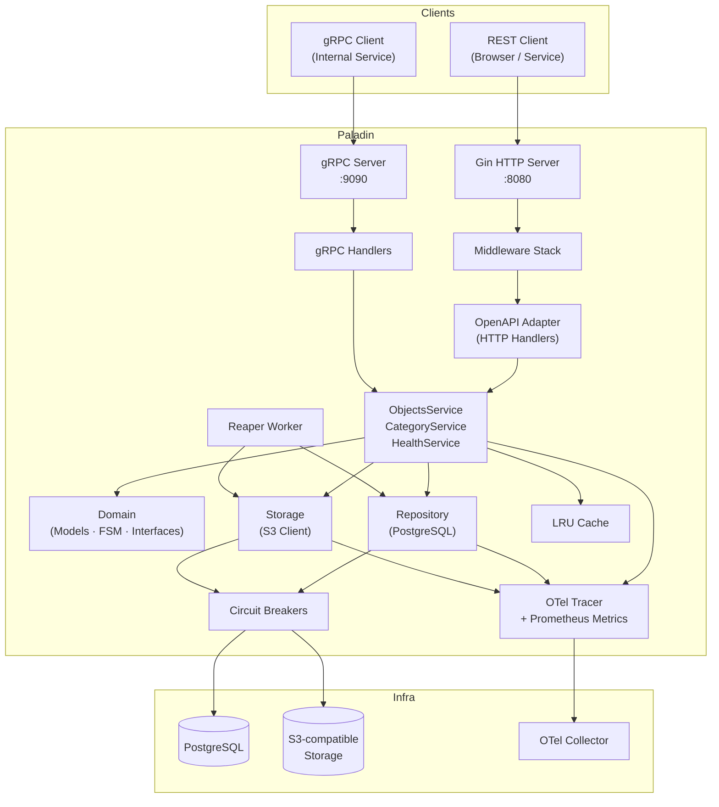
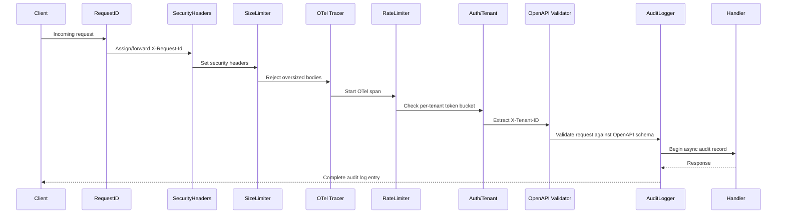
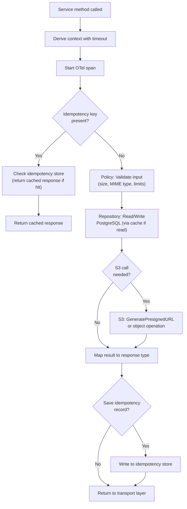
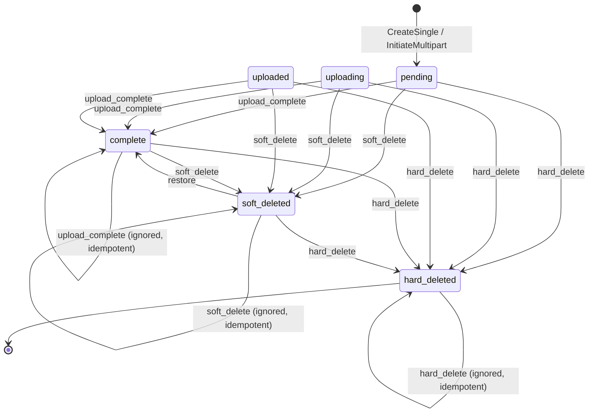
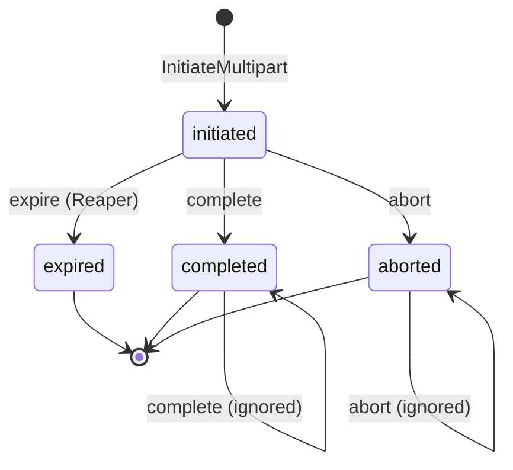
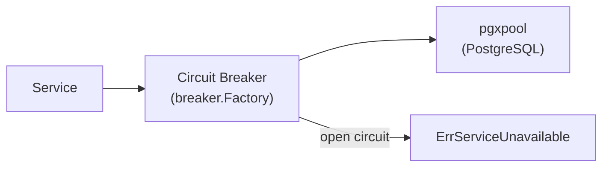
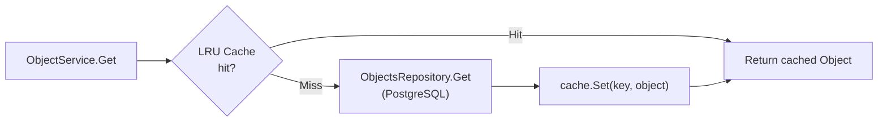
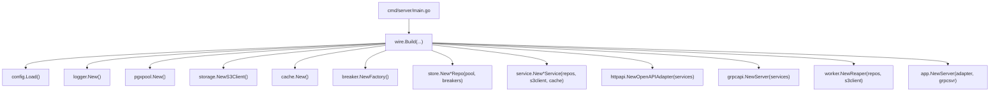
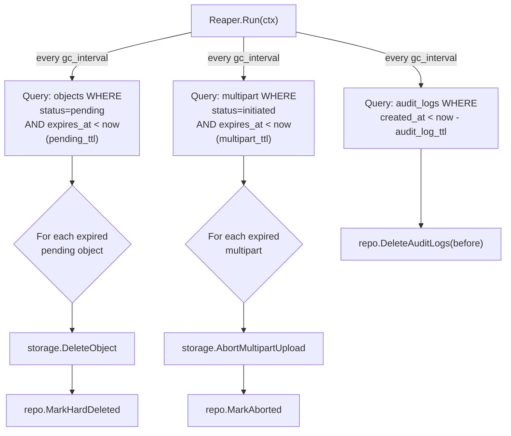

# Architecture

The `paladin` is a **presign-only control plane** built around a strict layered architecture: transport → service → domain → repository → storage. No layer talks past its immediate neighbour. Business logic never touches HTTP or SQL directly.

---

## Table of Contents

- [System Overview](#system-overview)
- [Layer Diagram](#layer-diagram)
- [Package Map](#package-map)
- [Transport Layer](#transport-layer)
- [Middleware Stack](#middleware-stack)
- [Service Layer](#service-layer)
- [Domain Layer](#domain-layer)
- [State Machines](#state-machines)
- [Repository Layer](#repository-layer)
- [Storage Layer](#storage-layer)
- [Cross-Cutting Concerns](#cross-cutting-concerns)
- [Dependency Injection (Wire)](#dependency-injection-wire)
- [Background Worker (Reaper)](#background-worker-reaper)
- [Design Principles](#design-principles)

---

## System Overview



---

## Layer Diagram

```mermaid
graph LR
    subgraph Transport ["Transport (internal/api/)"]
        HTTP["HTTP\nOpenAPIAdapter"]
        GRPC["gRPC\nHandlers"]
    end

    subgraph Middleware ["Middleware (internal/middleware/)"]
        direction TB
        M1["RequestID"]
        M2["Auth / Tenant"]
        M3["Rate Limiter"]
        M4["OpenAPI Validator"]
        M5["Audit Logger"]
        M6["OTel Tracer"]
        M7["Security Headers"]
        M8["Request Size Limit"]
    end

    subgraph Service ["Service (internal/service/)"]
        OS["ObjectService\n(CreateSingle, Get, Complete,\nDelete, Restore, Purge,\nList, PatchMeta, SignUpload,\nSignDownload, Bulk*)"]
        MP["Multipart\n(Initiate, SignPart,\nSignPartsBatch,\nComplete, Abort)"]
        CS["CategoryService"]
        HS["HealthService"]
    end

    subgraph Domain ["Domain (internal/domain/)"]
        IFACE["Interfaces\n(ObjectsService,\nCategoryService,\nObjectsRepository…)"]
        MODELS["Models\n(Object, Multipart,\nCategory, AuditLog…)"]
        FSM["State Machines\n(ObjectFSM,\nMultipartFSM)"]
        POLICY["Policy\n(Validate, Authorize)"]
    end

    subgraph Repo ["Repository (internal/store/)"]
        OBJ["objects_repo"]
        MP2["multipart_repo"]
        CAT["category_repo"]
        AUDIT["audit_repo"]
        IDEM["idempotency_repo"]
    end

    subgraph Storage ["Storage (internal/storage/)"]
        S3["S3Client\n(Presign, PutObject,\nDeleteObject,\nMultipart ops)"]
    end

    Transport --> Middleware --> Service
    Service --> Domain
    Service --> Repo
    Service --> Storage
```



---

## Package Map

| Package | Path | Responsibility |
|---------|------|----------------|
| `httpapi` | `internal/api/http/` | HTTP handler adapter, route registration |
| `grpcapi` | `internal/api/grpc/` | gRPC handler implementation |
| `middleware` | `internal/middleware/` | HTTP and gRPC middleware chain |
| `service` | `internal/service/` | Business logic, one file per operation |
| `domain` | `internal/domain/` | Interfaces, models, FSMs, errors |
| `store` | `internal/store/` | PostgreSQL repository implementations |
| `storage` | `internal/storage/` | S3 client abstraction |
| `cache` | `internal/cache/` | In-process LRU metadata cache |
| `breaker` | `internal/breaker/` | Circuit breaker factory |
| `config` | `internal/config/` | CUE-validated config loading |
| `observability` | `internal/observability/` | OTel tracer, span helpers |
| `metrics` | `internal/metrics/` | Prometheus metric definitions |
| `worker` | `internal/worker/` | Background Reaper goroutine |
| `wire` | `internal/wire/` | Wire DI provider sets |
| `generated/api` | `internal/generated/api/` | Auto-generated types from OpenAPI spec |
| `errors` | `internal/errors/` | Typed domain error sentinel values |
| `logger` | `internal/logger/` | Zap logger initialisation |
| `utils` | `internal/utils/` | Shared utilities (size parsing, etc.) |

---

## Transport Layer

### HTTP — `OpenAPIAdapter`

`OpenAPIAdapter` is a single struct that satisfies the **generated** `api.ServerInterface` (from `oapi-codegen`). It receives the request context, delegates to the service layer, and maps results to HTTP responses. It holds **no state** beyond injected dependencies.

```go
type OpenAPIAdapter struct {
    cfg       *config.Config
    svc       domain.ObjectsService    // Main business logic
    catSvc    domain.CategoryService   // Category management
    auditRepo domain.AuditLogRepository
    hs        *service.HealthService
    started   *atomic.Bool             // Startup gate
    version   string
}
```

Route registration is entirely code-generated — `api.RegisterHandlers(router, adapter)` wires all routes from the OpenAPI spec to the adapter methods.

### gRPC Transport

A parallel gRPC server exposes the same operations defined in `proto/paladin/v1/paladin.proto`. gRPC handlers follow the same pattern: validate → delegate to `domain.ObjectsService` → map to proto response.

---

## Middleware Stack

HTTP requests pass through a deterministic chain assembled in `internal/middleware/http_stack.go`:



| Middleware | File | Purpose |
|-----------|------|---------|
| `RequestID` | `request_id.go` | Propagate/generate `X-Request-Id` correlation ID |
| `SecurityHeaders` | `security_headers.go` | Set `X-Frame-Options`, `X-Content-Type-Options`, CSP |
| `RequestSizeLimit` | `request_size_limit.go` | Reject bodies exceeding `max_body_bytes` |
| `OTel` | `otel_http.go` | Inject trace context, create root span |
| `RateLimiter` | `ratelimit.go` | Per-tenant token-bucket; `429` on breach |
| `Auth/Tenant` | `auth.go` | Validate `X-Tenant-ID`; inject into context |
| `OpenAPIValidator` | `oapi_validate.go` | Schema-validate request body/params against spec |
| `AuditLogger` | `audit_log.go` | Async audit record on every mutating request |

---

## Service Layer

Business logic lives in `internal/service/`, decomposed into one file per operation to limit file size and enable focused testing.

```
service/
├── object_service.go       ← Struct definition + shared helpers
├── objects_create.go       ← CreateSingle
├── objects_get.go          ← Get, GetMeta
├── objects_complete.go     ← CompleteObject
├── objects_delete.go       ← Delete (soft), Purge (hard)
├── objects_update.go       ← Restore, BulkDelete, BulkRestore, BulkPurge
├── objects_list.go         ← List
├── objects_metadata.go     ← PatchMeta
├── signing_upload.go       ← SignUpload
├── signing_download.go     ← SignDownload
├── signing_parts.go        ← SignPart, SignPartsBatch
├── multipart_initiate.go   ← InitiateMultipart
├── multipart_complete.go   ← CompleteMultipart
├── multipart_abort.go      ← AbortMultipart
├── multipart_get.go        ← GetMultipart
├── policy.go               ← Policy validation
├── category_service.go     ← CategoryService impl
└── health.go               ← HealthService (readiness checks)
```

Every service method follows this pattern:



---

## Domain Layer

`internal/domain/` is the **architectural core** — it defines what the system does without saying how. Nothing inside `domain/` imports from `store/`, `storage/`, `middleware/`, or any transport package.

### Key interfaces

```go
// ObjectsService — what transport layers call
type ObjectsService interface {
    CreateSingle(ctx, tenantID, category, contentType, sizeBytes, labels, externalRef, uploadTTL, idempotencyKey) (CreateObjectResponse, error)
    Get, GetMeta, CompleteObject, Delete, Restore, Purge
    BulkDelete, BulkRestore, BulkPurge
    List, PatchMeta, SignUpload, SignDownload
    InitiateMultipart, SignPart, SignPartsBatch, CompleteMultipart, AbortMultipart
    GetStats
}

// ObjectsRepository — what ObjectsService calls
type ObjectsRepository interface {
    Create, Get, GetByExternalRef
    MarkComplete, MarkSoftDeleted, MarkHardDeleted
    Restore, UpdateStatus, Patch
    List, ListExpiredPending, GetStats
    Bulk{MarkSoftDeleted,Restore,Delete}
}

// CategoryService / CategoryRepository — category CRUD + guard
// MultipartRepository — multipart session state
// IdempotencyRepository — safe-retry semantics
// AuditLogRepository — append-only audit trail
```

---

## State Machines

State transitions are enforced by **`qmuntal/stateless`** FSMs defined in `internal/domain/fsm.go`. No repository method can bypass the FSM — the service calls `FSM.Fire(event)` before issuing the SQL update.

### Object FSM



### Multipart FSM



---

## Repository Layer

`internal/store/` contains one file per table (objects, multipart, categories, audit, idempotency), all using **pgx/v5** with connection pooling managed by `pgxpool`.

Key patterns:

- **Cursor-based pagination** using `created_at` + `id` for stable ordering
- **Partial indexes** on `(tenant_id, external_ref) WHERE external_ref IS NOT NULL` for efficient lookups
- **JSONB** for `labels` — indexed with GIN when label-based filtering is needed
- Optional **Row Level Security** (migration 003): each query session sets `SET LOCAL app.tenant_id = ?` so PostgreSQL policies enforce isolation at the DB engine level

All repository calls pass through **circuit breakers** (one per resource type: objects, multipart, categories, audit):



---

## Storage Layer

`internal/storage/` wraps the AWS SDK v2 S3 client. It provides:

| Operation | Description |
|-----------|-------------|
| `GeneratePresignedPutURL` | Single-object upload URL |
| `GeneratePresignedGetURL` | Download URL |
| `CreateMultipartUpload` | Start S3 multipart session |
| `GeneratePresignedPartURL` | Sign individual part |
| `CompleteMultipartUpload` | Finalize session |
| `AbortMultipartUpload` | Cancel + release S3 resources |
| `DeleteObject` | Hard-delete from S3 |
| `HeadBucket` | Connectivity probe (readiness) |
| `HeadObject` | Object existence check |

The storage layer is also wrapped in a **circuit breaker** to degrade gracefully if S3 is unavailable.

---

## Cross-Cutting Concerns

### Caching

`internal/cache/` wraps `hashicorp/golang-lru` to cache object metadata after reads. Write operations (complete, patch, delete) invalidate the corresponding cache entry.



Expected hit rate: **70–90%** for read-heavy workloads.

### Observability

Every service method is wrapped in an OTel span via `internal/observability/`:

```go
ctx, span := tracer.Start(ctx, "ObjectService.CreateSingle")
defer span.End()
span.SetAttributes(
    attribute.String("tenant_id", tenantID),
    attribute.String("content_type", contentType),
    attribute.Int64("size_bytes", sizeBytes),
)
```

Prometheus metrics are registered in `internal/metrics/` and exposed at `GET /metrics`:

| Metric | Labels | Description |
|--------|--------|-------------|
| `paladin_object_operation_duration_seconds` | `operation`, `status` | Service method latency |
| `paladin_s3_operation_duration_seconds` | `operation`, `status` | S3 SDK call latency |
| `paladin_db_query_duration_seconds` | `query`, `status` | Repository query latency |
| `paladin_cache_operations_total` | `result` (hit/miss) | Cache effectiveness |
| `paladin_rate_limiter_tenants` | — | Active per-tenant buckets |

### Error Handling

`internal/errors/` defines typed sentinel errors (`ErrNotFound`, `ErrConflict`, `ErrTooLarge`, etc.). The HTTP adapter maps these to RFC 7807 Problem Details responses via a central error mapper. gRPC handlers map them to gRPC status codes.

---

## Dependency Injection (Wire)

`internal/wire/` uses **google/wire** to assemble the dependency graph at compile time. There are no `init()` singletons or global state.



---

## Background Worker (Reaper)

`internal/worker/` runs a periodic goroutine (configurable `gc_interval`, default 1 h) that performs cleanup:



---

## Design Principles

| Principle | How it's applied |
|-----------|-----------------|
| **Interface-first** | Every service and repository is an interface in `domain/`. Concrete impls are in `service/` and `store/`. Mocks are generated for unit tests. |
| **No data proxying** | Object bytes never touch PALADIN. Only metadata and presigned URLs are managed. |
| **Idempotent state transitions** | FSMs use `.Ignore()` for duplicate events — `complete → complete` is a no-op, not an error. |
| **Defence in depth** | Validation happens at three layers: OpenAPI schema (middleware), Policy (service), and foreign-key constraints (database). |
| **Graceful degradation** | Circuit breakers on all external calls. When S3 is unavailable, the `readyz` probe fails and Kubernetes removes the pod from rotation. |
| **Structured concurrency** | Context propagation throughout. Every goroutine respects `ctx.Done()`. Reaper and shutdown use `sync.WaitGroup`. |
| **Secrets never in memory longer than needed** | Config loaded once at startup; credentials not logged (`log_sensitive: false`). |

---

*Last updated: 2026-02-24 · Go version: 1.24*
