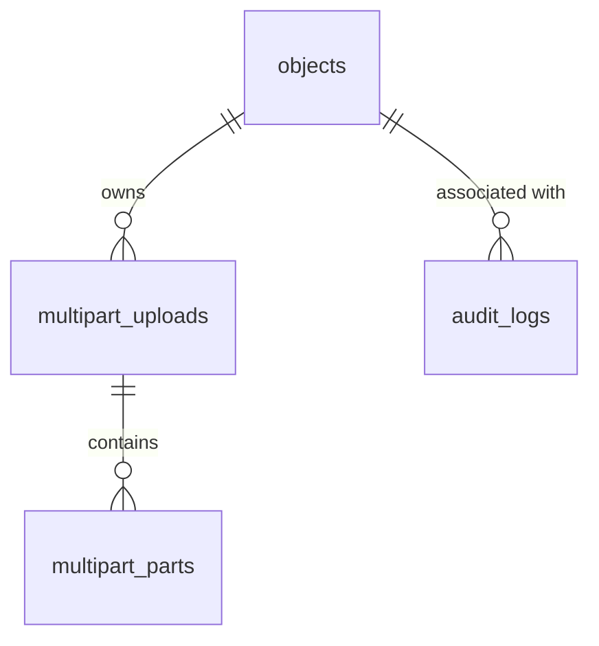

# Database Documentation

The `paladin` service uses PostgreSQL to manage object metadata, multipart upload states, idempotency, and audit logs.

## Entity Relationship Diagram

## Tables

### 1. `objects`

Stores the primary metadata and lifecycle status for all objects.

| Column | Type | Description |
| :--- | :--- | :--- |
| `id` | UUID | Primary key. |
| `tenant_id` | TEXT | Multi-tenant isolation key. |
| `object_key` | TEXT | S3 object key (unique per tenant). |
| `bucket` | TEXT | S3 bucket name. |
| `content_type` | TEXT | MIME type. |
| `size_bytes` | BIGINT | Initial declared size. |
| `stored_size_bytes`| BIGINT | Actual size in storage (v1.1.0). |
| `checksum_sha256` | TEXT | Optional integrity checksum. |
| `stored_etag` | TEXT | ETag from S3 after completion (v1.1.0). |
| `status` | TEXT | `pending`, `uploading`, `uploaded`, `complete`, `aborted`, `soft_deleted`, `hard_deleted`, `error`. |
| `labels` | JSONB | Custom key-value tags. |
| `external_ref` | TEXT | External system reference (unique per tenant). |
| `created_at` | TIMESTAMPTZ | Creation timestamp. |
| `updated_at` | TIMESTAMPTZ | Last update timestamp. |
| `completed_at` | TIMESTAMPTZ | When upload was finalized (v1.1.0). |
| `deleted_at` | TIMESTAMPTZ | When soft-deleted (v1.1.0). |
| `expires_at` | TIMESTAMPTZ | Optional expiration time for TTL. |

**Indexes:**

- `idx_objects_tenant_created_at`: `(tenant_id, created_at DESC)`
- `uq_objects_tenant_key`: `(tenant_id, object_key)` UNIQUE
- `uq_objects_tenant_external_ref`: `(tenant_id, external_ref)` UNIQUE

---

### 2. `multipart_uploads`

Tracks active S3 multipart upload sessions.

| Column | Type | Description |
| :--- | :--- | :--- |
| `id` | UUID | Primary key. |
| `tenant_id` | TEXT | Multi-tenant isolation key. |
| `object_id` | UUID | References `objects(id)` (CASCADE). |
| `upload_id` | TEXT | S3-provided upload identifier. |
| `status` | TEXT | `initiated`, `uploaded`, `completed`, `aborted`, `expired`. |
| `part_size_bytes`| BIGINT | Size of each part. |
| `expires_at` | TIMESTAMPTZ | Session expiration. |

---

### 3. `multipart_parts`

Stores information about individual parts of a multipart upload (optional tracking).

| Column | Type | Description |
| :--- | :--- | :--- |
| `multipart_id` | UUID | References `multipart_uploads(id)` (CASCADE). |
| `part_number` | INTEGER | Part sequence (1-indexed). |
| `etag` | TEXT | S3 ETag for this part. |
| `size_bytes` | BIGINT | Part size. |

---

### 4. `audit_logs`

Comprehensive log of all API requests and responses for a tenant.

| Column | Type | Description |
| :--- | :--- | :--- |
| `id` | UUID | Primary key. |
| `tenant_id` | TEXT | Tenant ID. |
| `request_id` | TEXT | Correlation ID. |
| `actor_subject` | TEXT | Who performed the action. |
| `method` | TEXT | HTTP Method. |
| `path` | TEXT | API Path. |
| `http_status` | INTEGER | Response status code. |
| `response_time_ms`| INTEGER | Latency. |
| `created_at` | TIMESTAMPTZ | Event time. |

---

### 5. `idempotency_keys`

Ensures at-most-once semantics for mutation operations.

| Column | Type | Description |
| :--- | :--- | :--- |
| `tenant_id` | TEXT | Tenant ID. |
| `idempotency_key` | TEXT | Unique key provided by client. |
| `response_code` | INTEGER | Buffered response status. |
| `response_body` | JSONB | Buffered response payload. |
| `expires_at` | TIMESTAMPTZ | Cleanup time. |

---

## Security

- **Row Level Security (RLS)**: Enabled on all tables to ensure strict tenant isolation at the database level.
- **Policies**: `tenant_id = current_setting('app.tenant_id')` must match for all operations.
