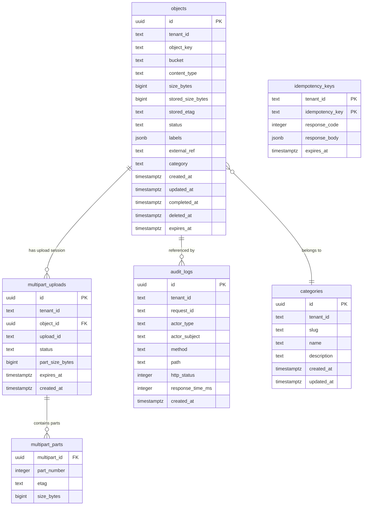
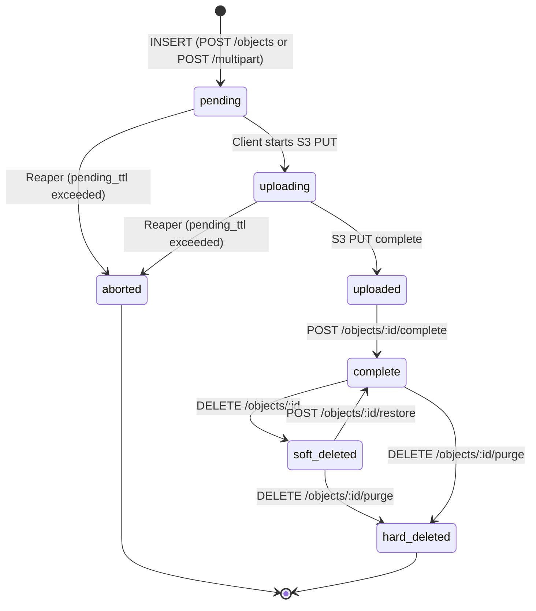

# Database Documentation

The `paladin` service uses **PostgreSQL** as its system of record for object metadata, multipart upload sessions, idempotency tracking, categories, and audit logs.

---

## Entity Relationship Diagram



---

## Object Status State Machine



---

## Tables

### `objects`

Primary metadata store for all upload sessions and objects.

| Column | Type | Nullable | Description |
|--------|------|----------|-------------|
| `id` | UUID | NO | Primary key |
| `tenant_id` | TEXT | NO | Tenant scope |
| `object_key` | TEXT | NO | Unique S3 key within bucket |
| `bucket` | TEXT | NO | S3 bucket name |
| `content_type` | TEXT | NO | MIME type |
| `size_bytes` | BIGINT | NO | Declared size |
| `stored_size_bytes` | BIGINT | YES | Actual stored size (set on complete) |
| `checksum_sha256` | TEXT | YES | Optional integrity checksum |
| `stored_etag` | TEXT | YES | S3 ETag after completion |
| `status` | TEXT | NO | See state machine above |
| `labels` | JSONB | YES | Key-value metadata map |
| `external_ref` | TEXT | YES | Opaque client-provided ID |
| `category` | TEXT | YES | Category slug |
| `created_at` | TIMESTAMPTZ | NO | Row creation time |
| `updated_at` | TIMESTAMPTZ | NO | Last modification time |
| `completed_at` | TIMESTAMPTZ | YES | When upload was completed |
| `deleted_at` | TIMESTAMPTZ | YES | When soft-delete was applied |
| `expires_at` | TIMESTAMPTZ | YES | Upload session expiry (for pending GC) |

**Indexes**:

| Name | Columns | Type | Notes |
|------|---------|------|-------|
| `uq_objects_tenant_key` | `(tenant_id, object_key)` | UNIQUE | |
| `uq_objects_tenant_external_ref` | `(tenant_id, external_ref)` | UNIQUE PARTIAL | `WHERE external_ref IS NOT NULL` |
| `idx_objects_tenant_created` | `(tenant_id, created_at DESC)` | BTREE | List queries |
| `idx_objects_tenant_status_created` | `(tenant_id, status, created_at DESC)` | BTREE | Filtered list queries |
| `idx_objects_tenant_external_ref` | `(tenant_id, external_ref)` | BTREE PARTIAL | `WHERE external_ref IS NOT NULL` |
| `idx_objects_pending_expires` | `(expires_at)` | BTREE PARTIAL | `WHERE status = 'pending' AND expires_at IS NOT NULL` (Reaper) |

---

### `multipart_uploads`

Tracks active S3 multipart upload sessions. Each session links to one `objects` row.

| Column | Type | Nullable | Description |
|--------|------|----------|-------------|
| `id` | UUID | NO | Primary key |
| `tenant_id` | TEXT | NO | Tenant scope |
| `object_id` | UUID | NO | FK → `objects(id)` ON DELETE CASCADE |
| `upload_id` | TEXT | NO | S3 multipart upload ID |
| `status` | TEXT | NO | `initiated`, `completed`, `aborted`, `expired` |
| `part_size_bytes` | BIGINT | NO | Recommended part size |
| `expires_at` | TIMESTAMPTZ | NO | Session expiry |
| `created_at` | TIMESTAMPTZ | NO | Session creation time |

**Indexes**: `(tenant_id, status, created_at DESC)`, `(upload_id)`, `(expires_at) WHERE status = 'initiated'` (Reaper)

---

### `multipart_parts`

Individual part tracking for multipart uploads. Used when assembling the completion request.

| Column | Type | Nullable | Description |
|--------|------|----------|-------------|
| `multipart_id` | UUID | NO | FK → `multipart_uploads(id)` ON DELETE CASCADE |
| `part_number` | INTEGER | NO | 1-indexed part sequence |
| `etag` | TEXT | NO | S3 ETag returned on part upload |
| `size_bytes` | BIGINT | NO | Part size |

**Primary key**: `(multipart_id, part_number)`

---

### `categories`

Named groups that objects can be assigned to. Deletion is blocked while objects are assigned.

| Column | Type | Nullable | Description |
|--------|------|----------|-------------|
| `id` | UUID | NO | Primary key |
| `tenant_id` | TEXT | NO | Tenant scope |
| `slug` | TEXT | NO | URL-safe identifier (unique per tenant) |
| `name` | TEXT | NO | Display name |
| `description` | TEXT | YES | Optional description |
| `created_at` | TIMESTAMPTZ | NO | Creation time |
| `updated_at` | TIMESTAMPTZ | NO | Last modification time |

**Unique index**: `(tenant_id, slug)`

---

### `audit_logs`

Append-only log of every API request and response. Written by middleware on every HTTP request.

| Column | Type | Nullable | Description |
|--------|------|----------|-------------|
| `id` | UUID | NO | Primary key |
| `tenant_id` | TEXT | NO | Tenant scope |
| `request_id` | TEXT | YES | Correlation ID from `X-Request-Id` |
| `actor_type` | TEXT | YES | `service`, `user`, etc. |
| `actor_subject` | TEXT | YES | OIDC subject or service account |
| `method` | TEXT | NO | HTTP method |
| `path` | TEXT | NO | Request path |
| `http_status` | INTEGER | YES | HTTP response status code |
| `response_time_ms` | INTEGER | YES | Latency in milliseconds |
| `created_at` | TIMESTAMPTZ | NO | Event timestamp |

**Indexes**: `(tenant_id, created_at DESC)`, `(tenant_id, path, created_at DESC)`, `(tenant_id, method, created_at DESC)`, `(created_at)` (Reaper)

---

### `idempotency_keys`

Caches responses for safe retry of mutation requests. Cleaned up by the Reaper after TTL.

| Column | Type | Nullable | Description |
|--------|------|----------|-------------|
| `tenant_id` | TEXT | NO | PK part 1 |
| `idempotency_key` | TEXT | NO | PK part 2 |
| `response_code` | INTEGER | NO | Cached HTTP status |
| `response_body` | JSONB | YES | Cached response payload |
| `expires_at` | TIMESTAMPTZ | NO | Cleanup time |

---

## Migrations

Migrations are plain SQL files applied using `golang-migrate`:

```
migrations/
├── 001_initial_schema.up.sql      — objects, multipart_uploads, multipart_parts
├── 002_audit_idempotency.up.sql   — audit_logs, idempotency_keys
├── 003_rls.up.sql                 — Row Level Security policies (disabled by default)
├── 004_categories.up.sql          — categories table
└── ...down.sql                    — Corresponding down migrations
```

Apply migrations:

```bash
task migrate:up
```

---

## Row Level Security (RLS)

RLS is **disabled by default** (requires `enable_rls: true` in config and migration 003).

When enabled, every query requires `SET LOCAL app.tenant_id = '...'` and all policies enforce:

```sql
USING (tenant_id = current_setting('app.tenant_id'))
```

> **Warning**: Enabling RLS without running migration 003 will cause silent runtime failures.

---

*Last updated: 2026-02-24*
