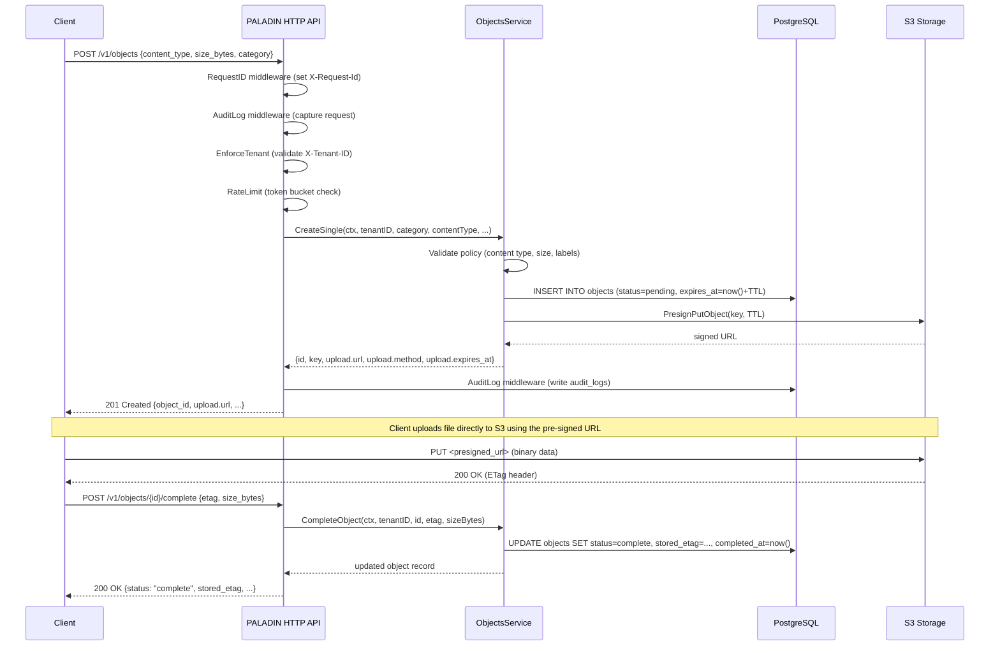
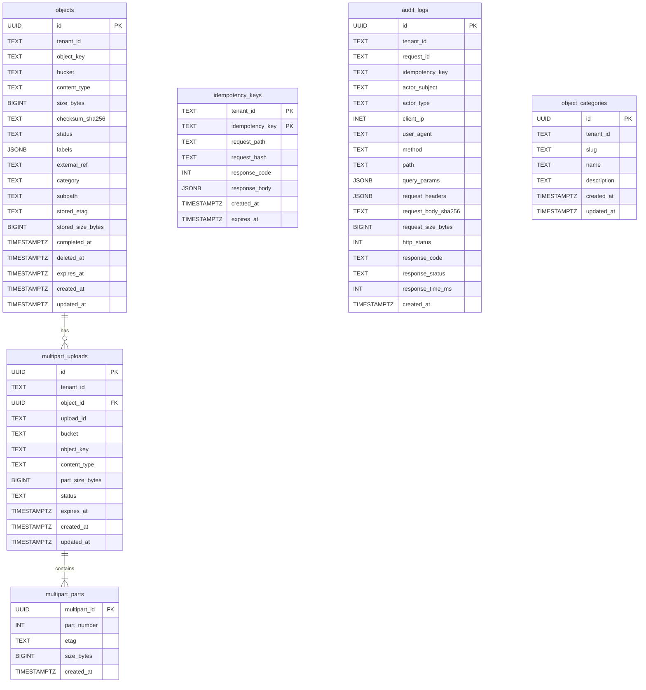
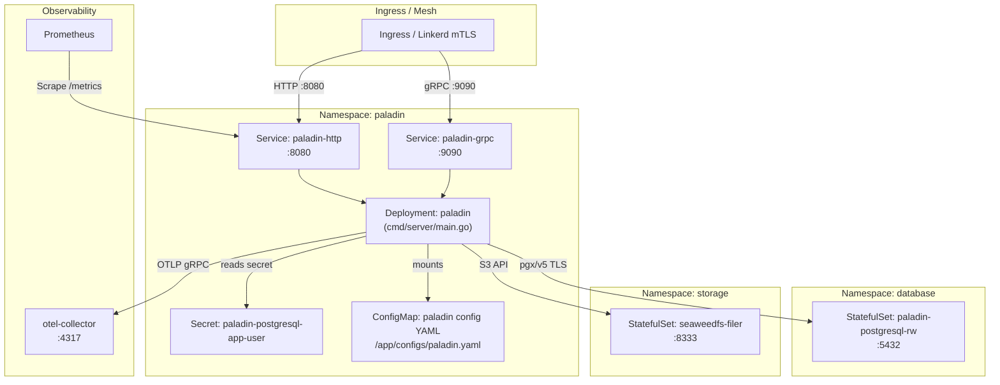

# Diagrams

All diagrams use [Mermaid](https://mermaid.js.org/) syntax. Component names match those found in source code.

---

## 1. Context Diagram (C4-like)

```mermaid
C4Context
  title Paladin — System Context

  Person(caller, "Client (API Consumer)", "Any service calling PALADIN via HTTP REST or gRPC")

  System_Boundary(paladin, "Paladin") {
    Container(http_api, "HTTP API Server", "Gin, Port 8080", "REST API: objects, multipart, categories, health, metrics")
    Container(grpc_api, "gRPC Server", "google.golang.org/grpc, Port 9090", "Proto: Paladin service")
    Container(reaper, "Reaper Worker", "Go goroutine", "Background cleanup of expired objects, multiparts, audit logs")
    ContainerDb(postgres, "PostgreSQL", "pgxpool", "Metadata: objects, categories, idempotency, audit logs")
  }

  System_Ext(s3, "S3-Compatible Storage", "SeaweedFS (local/staging), Amazon S3 (prod)")
  System_Ext(k8s_secrets, "Kubernetes Secrets", "DB password, S3 access/secret keys")
  System_Ext(otel_collector, "OpenTelemetry Collector", "OTLP traces/metrics export (optional)")
  System_Ext(prometheus, "Prometheus", "Scrapes /metrics endpoint")

  Rel(caller, http_api, "REST API calls", "HTTP/1.1, JSON")
  Rel(caller, grpc_api, "gRPC calls", "HTTP/2, Protocol Buffers")
  Rel(http_api, postgres, "Read/write metadata", "pgx/v5")
  Rel(grpc_api, postgres, "Read/write metadata", "pgx/v5")
  Rel(http_api, s3, "Pre-sign URLs", "AWS SDK v2")
  Rel(grpc_api, s3, "Pre-sign URLs", "AWS SDK v2")
  Rel(reaper, postgres, "Delete expired records", "pgx/v5")
  Rel(reaper, s3, "Abort multipart uploads", "AWS SDK v2")
  Rel(http_api, otel_collector, "OTLP traces/metrics", "gRPC/HTTP")
  Rel(prometheus, http_api, "Scrape /metrics", "HTTP")
  Rel(paladin, k8s_secrets, "Read secrets at startup", "Kubernetes API")
```

---

## 2. Main Request Sequence — Single Object Upload



---

## 3. ER Diagram



---

## 4. Deployment Diagram (Kubernetes)


