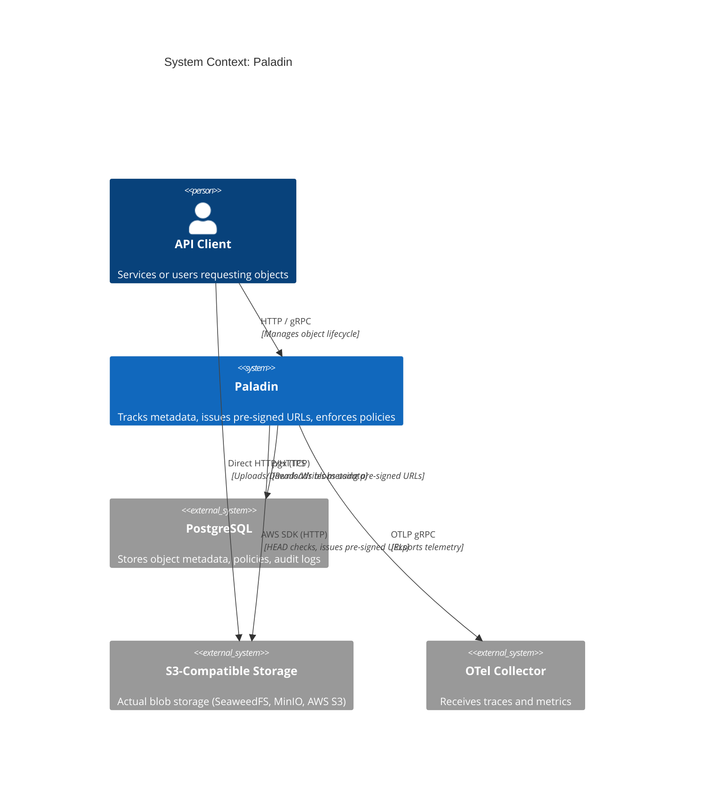
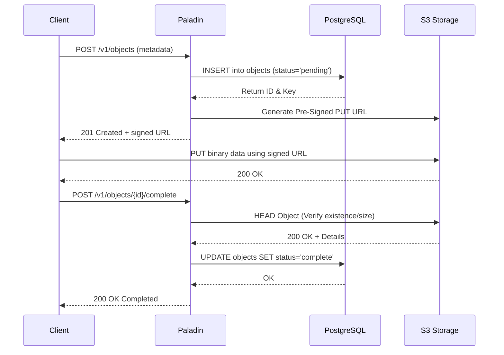
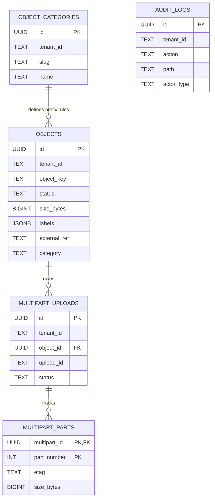
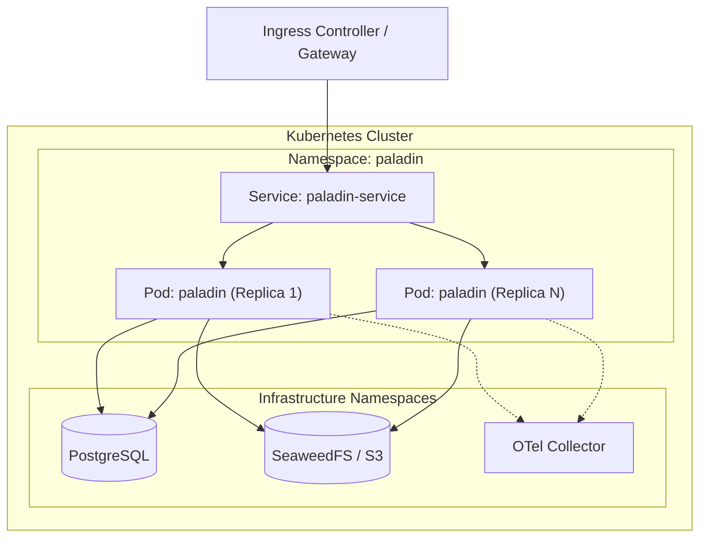

# Diagrams

## 1. Context Diagram

```mermaid
C4Context
    title System Context: Paladin

    Person(client, "API Client", "Services or users requesting objects")
    
    System(paladin, "Paladin", "Tracks metadata, issues pre-signed URLs, enforces policies")
    
    System_Ext(postgres, "PostgreSQL", "Stores object metadata, policies, audit logs")
    System_Ext(s3, "S3-Compatible Storage", "Actual blob storage (SeaweedFS, MinIO, AWS S3)")
    System_Ext(otel, "OTel Collector", "Receives traces and metrics")
    
    Rel(client, paladin, "HTTP / gRPC", "Manages object lifecycle")
    Rel(paladin, postgres, "pgx (TCP)", "Reads/Writes metadata")
    Rel(paladin, s3, "AWS SDK (HTTP)", "HEAD checks, issues pre-signed URLs")
    Rel(paladin, otel, "OTLP gRPC", "Exports telemetry")
    Rel(client, s3, "Direct HTTP/HTTPS", "Uploads/Downloads blobs using pre-signed URLs")
```

## 2. Main Request Sequence

```mermaid
sequenceDiagram
    participant Client
    participant PALADIN as Paladin
    participant DB as PostgreSQL
    participant S3 as S3 Storage

    Client->>PALADIN: POST /v1/objects (metadata)
    PALADIN->>DB: INSERT into objects (status='pending')
    DB-->>PALADIN: Return ID & Key
    PALADIN->>S3: Generate Pre-Signed PUT URL
    PALADIN-->>Client: 201 Created + signed URL
    
    Client->>S3: PUT binary data using signed URL
    S3-->>Client: 200 OK
    
    Client->>PALADIN: POST /v1/objects/{id}/complete
    PALADIN->>S3: HEAD Object (Verify existence/size)
    S3-->>PALADIN: 200 OK + Details
    PALADIN->>DB: UPDATE objects SET status='complete'
    DB-->>PALADIN: OK
    PALADIN-->>Client: 200 OK Completed
```

## 3. ER / Schema Diagram

```mermaid
erDiagram
    OBJECTS {
        UUID id PK
        TEXT tenant_id
        TEXT object_key
        TEXT status
        BIGINT size_bytes
        JSONB labels
        TEXT external_ref
        TEXT category
    }

    OBJECT_CATEGORIES {
        UUID id PK
        TEXT tenant_id
        TEXT slug
        TEXT name
    }

    MULTIPART_UPLOADS {
        UUID id PK
        TEXT tenant_id
        UUID object_id FK
        TEXT upload_id
        TEXT status
    }

    MULTIPART_PARTS {
        UUID multipart_id PK,FK
        INT part_number PK
        TEXT etag
        BIGINT size_bytes
    }

    AUDIT_LOGS {
        UUID id PK
        TEXT tenant_id
        TEXT action
        TEXT path
        TEXT actor_type
    }

    OBJECT_CATEGORIES ||--o{ OBJECTS : "defines prefix rules"
    OBJECTS ||--o{ MULTIPART_UPLOADS : "owns"
    MULTIPART_UPLOADS ||--o{ MULTIPART_PARTS : "tracks"
```

## 4. Deployment Diagram

```mermaid
flowchart TD
    subgraph Kubernetes["Kubernetes Cluster"]
        subgraph PALADIN_Namespace["Namespace: paladin"]
            Pod1["Pod: paladin (Replica 1)"]
            Pod2["Pod: paladin (Replica N)"]
            
            SVC["Service: paladin-service"]
            
            SVC --> Pod1
            SVC --> Pod2
        end
        
        subgraph System_Namespaces["Infrastructure Namespaces"]
            DB[(PostgreSQL)]
            S3[(SeaweedFS / S3)]
            OTel[OTel Collector]
        end
    end
    
    Ingress[Ingress Controller / Gateway] --> SVC
    
    Pod1 --> DB
    Pod2 --> DB
    
    Pod1 --> S3
    Pod2 --> S3
    
    Pod1 -.-> OTel
    Pod2 -.-> OTel
```
