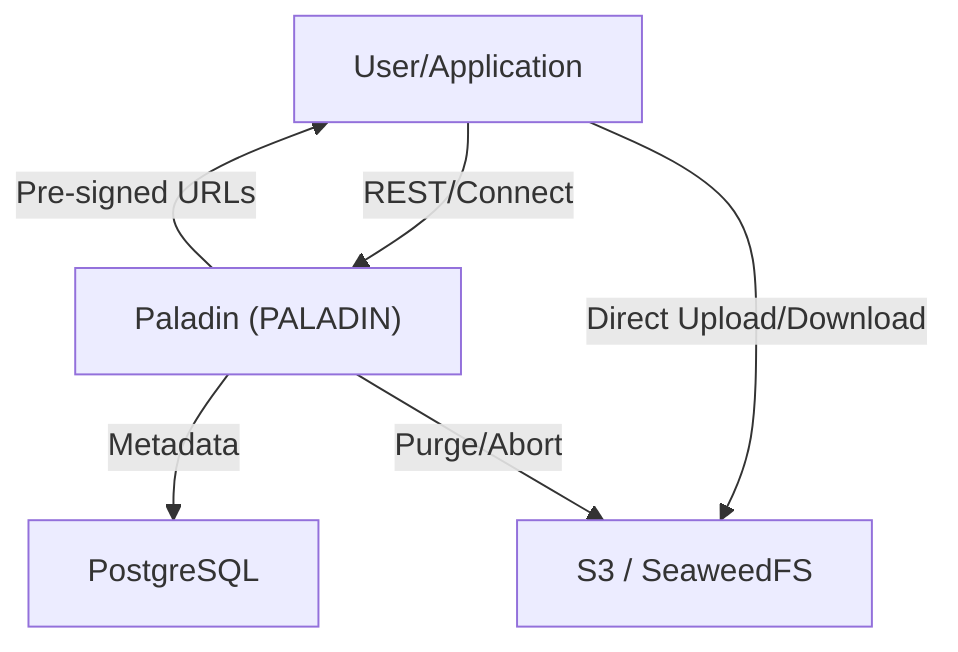
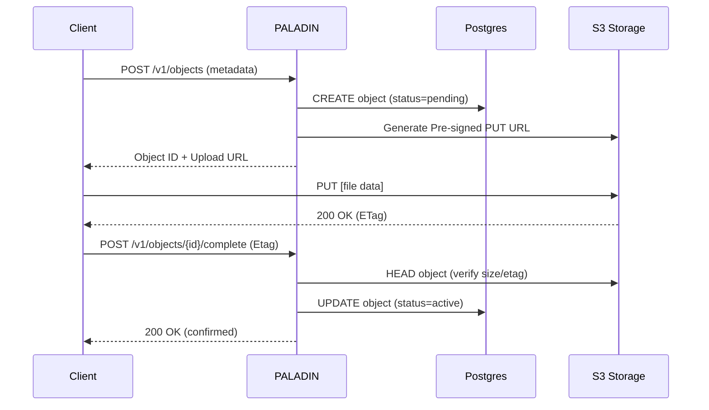
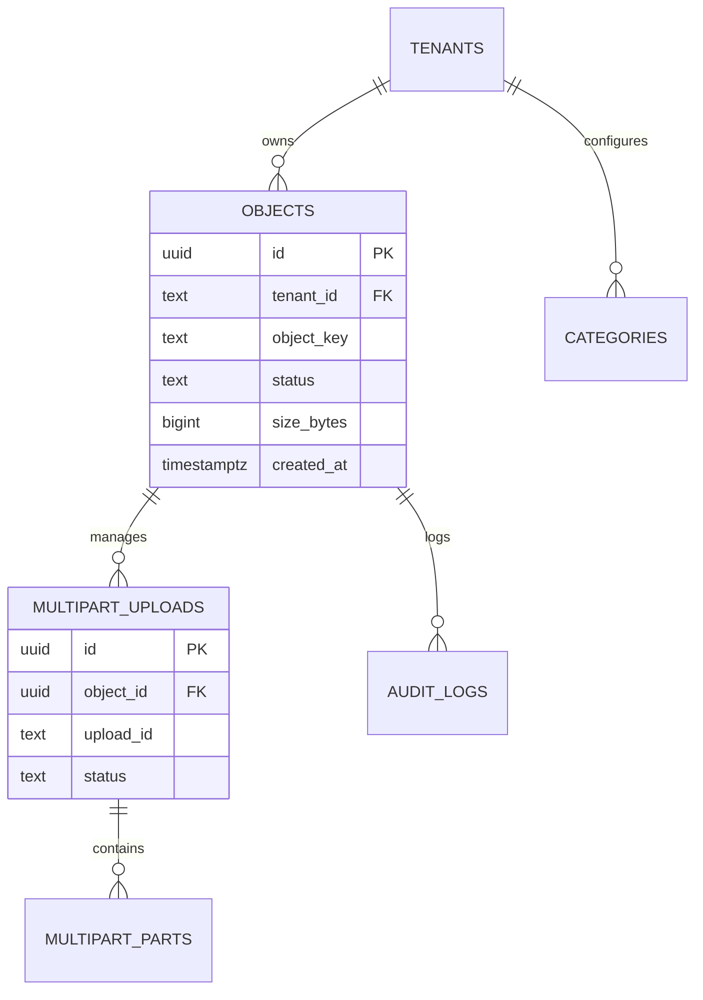
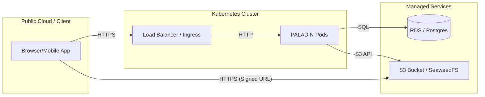

# Diagrams - Paladin (PALADIN)

## Context Diagram (C4-like)

```mermaid
graph TD
    User["User/Application"] -- "REST/Connect" --> PALADIN["Paladin (PALADIN)"]
    PALADIN -- "Metadata" --> DB["PostgreSQL"]
    PALADIN -- "Pre-signed URLs" --> User
    User -- "Direct Upload/Download" --> S3["S3 / SeaweedFS"]
    PALADIN -- "Purge/Abort" --> S3
```

## Object Creation Sequence (Single Upload)

```mermaid
sequenceDiagram
    participant C as Client
    participant PALADIN as PALADIN
    participant DB as Postgres
    participant S3 as S3 Storage

    C->>PALADIN: POST /v1/objects (metadata)
    PALADIN->>DB: CREATE object (status=pending)
    PALADIN->>S3: Generate Pre-signed PUT URL
    PALADIN-->>C: Object ID + Upload URL
    C->>S3: PUT [file data]
    S3-->>C: 200 OK (ETag)
    C->>PALADIN: POST /v1/objects/{id}/complete (Etag)
    PALADIN->>S3: HEAD object (verify size/etag)
    PALADIN->>DB: UPDATE object (status=active)
    PALADIN-->>C: 200 OK (confirmed)
```

## Entity Relationship Diagram (Schema)

```mermaid
erDiagram
    TENANTS ||--o{ OBJECTS : "owns"
    TENANTS ||--o{ CATEGORIES : "configures"
    OBJECTS ||--o{ MULTIPART_UPLOADS : "manages"
    OBJECTS ||--o{ AUDIT_LOGS : "logs"
    MULTIPART_UPLOADS ||--o{ MULTIPART_PARTS : "contains"
    OBJECTS {
        uuid id PK
        text tenant_id FK
        text object_key
        text status
        bigint size_bytes
        timestamptz created_at
    }
    MULTIPART_UPLOADS {
        uuid id PK
        uuid object_id FK
        text upload_id
        text status
    }
```

## Deployment Topology

```mermaid
graph LR
    subgraph "Public Cloud / Client"
        C["Browser/Mobile App"]
    end
    subgraph "Kubernetes Cluster"
        PALADIN["PALADIN Pods"]
        LB["Load Balancer / Ingress"]
    end
    subgraph "Managed Services"
        DB[("RDS / Postgres")]
        S3["S3 Bucket / SeaweedFS"]
    end

    C -- "HTTPS" --> LB
    LB -- "HTTP" --> PALADIN
    PALADIN -- "SQL" --> DB
    PALADIN -- "S3 API" --> S3
    C -- "HTTPS (Signed URL)" --> S3
```
