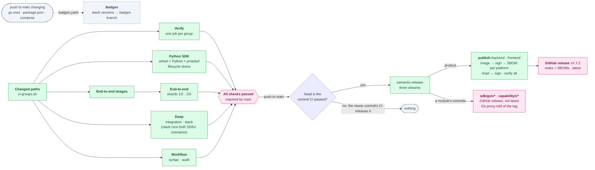

# How changes land

`main` is the only long-lived branch. Changes reach it through pull requests,
with [Conventional Commits](https://www.conventionalcommits.org/en/v1.0.0/).
The commit type is what decides the next release, so a subject that does not
follow the format releases nothing.

[`ci.yaml`](../.github/workflows/ci.yaml) runs the groups of `verify-all` a
change can reach — `verify-backend`, `verify-capability`, `verify-sdk`,
`verify-frontend` and `verify-repo`, one job each — and audits the workflows
with actionlint and zizmor. A change the `sdk` group reaches also installs the
Python SDK's wheel beside each protobuf major and Python it supports, one job
per cell of [`sdk/python/compat.json`](../sdk/python/compat.json)
(`verify-py-sdk-compat` locally), and runs the client lifecycle stress in
`sdk/python/tests/test_lifecycle.py` at a count high enough to catch an
intermittent abort at exit. [`scripts/ci-groups.sh`](../scripts/ci-groups.sh)
decides which groups a set of paths reaches; a console-only change does not
run the backend's tests. Run by hand, it runs every group. A final `All checks
passed` job is the one check branch protection requires, so a group that was
skipped does not block a merge and a group that failed does.
[`codeql.yaml`](../.github/workflows/codeql.yaml) runs CodeQL on the Go,
TypeScript, Python and workflow code.

A change that touches only documentation (Markdown, `docs/`, images, the
licence files) runs no verify group and no CodeQL analysis, and does not
dispatch a release. Its commits count towards the next release a code change
triggers.

Any other green push to `main` dispatches
[`release.yaml`](../.github/workflows/release.yaml). semantic-release computes
the next tag from the commits since the last one; both images and both charts
are pushed to GHCR at that version, and the GitHub release with generated
notes is created once all of them are. The same run cuts `sdk/go/v*` and
`capability/v*` when a commit touched those modules; the `api/v*` baseline is
cut by hand. See [releasing.md](releasing.md).

`ci.yaml` pushes no image and deploys nothing. Images and charts are published
only by `release.yaml`, for a release tag. Its End-to-end images job builds
both images once, and its two End-to-end jobs run `verify-e2e:run` —
Playwright against a stack booted from those images — each on half the suite
(`PALADIN_E2E_SHARD`), when the change reaches the console or the backend, and its two Deep jobs run the halves of
`verify-deep` side by side — `verify-deep:integration`, the Postgres-backed
suites, and `verify-deep:stack`, the stack gate, which also drives both
SDKs through the scenarios in `sdk/testdata/scenarios.json` — when the
change reaches the backend or an SDK. The `All checks passed` check that `main` requires waits for all of them;
[task.md](task.md#working-on-the-code) lists them for running locally.

Every check `ci.yaml` runs has a local task. The verify groups, `verify-e2e` and
`verify-deep` are those tasks; its Workflow syntax and Workflow audit jobs
(actionlint, zizmor) are `task -t Taskfile.dev.yaml verify:workflows`, at the
versions `ci.yaml` pins. The Python SDK lifecycle job is `py-sdk:test` with
`PALADIN_LIFECYCLE_RUNS` raised; the test suite runs a few of the same cycles
every time. Three things have no local form, by their nature:
CodeQL ([`codeql.yaml`](../.github/workflows/codeql.yaml)), which is GitHub's
own analysis and reports to the repository's code-scanning alerts; the
publishing workflow, [`release.yaml`](../.github/workflows/release.yaml), which
pushes images, charts and the release tags and runs only from `main`; and
[`badges.yaml`](../.github/workflows/badges.yaml), which pushes the stack
versions the README's badges read to the `badges` branch — the script that
reads them is `verify:badge-versions`.
